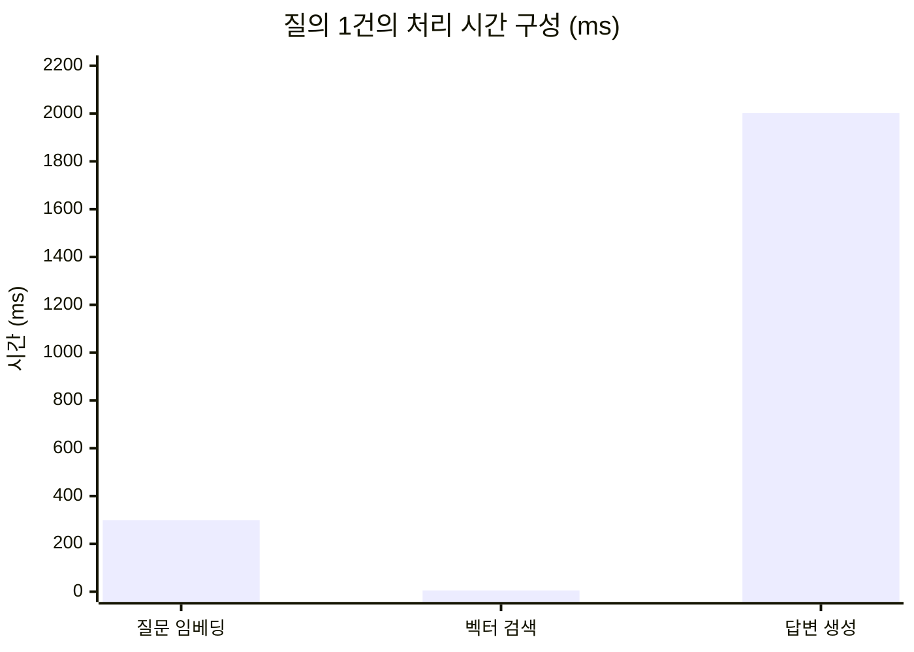

# DocuMind

> PDF 문서를 업로드하면 내용을 근거로 질문에 답하는 RAG 기반 문서 질의응답 백엔드

<br/>

## 이 프로젝트에서 다룬 것

LLM 호출은 파이프라인의 한 단계일 뿐이고, 이 프로젝트의 관심사는 그 주변의 **백엔드 문제**입니다. 청킹, 벡터 저장과 검색, 트랜잭션 경계, 비용 기록은 라이브러리에 맡기지 않고 직접 구현했습니다.

| 문제 | 접근 | 결과 |
|---|---|---|
| 청크 수천 개를 한 건씩 INSERT | ID 전략을 SEQUENCE로 분리하고 JDBC 배치 활성화 | 청크 INSERT 9건이 **JDBC 배치 1회**로 실행됨 (세션 통계로 확인) |
| 외부 API 대기 중 DB 커넥션 점유 | API 호출을 트랜잭션 밖으로, 저장만 짧은 트랜잭션으로 | API 대기 중 커넥션 미점유, 실패 시 **FAILED 기록을 별도 트랜잭션으로 보존**하도록 설계 |
| PDF 추출 텍스트에 깨진 글자 혼입 | 원인 분석 후 대체 문자를 공백으로 정규화, 효과 측정 | 검색 순위 영향 **없음** 확인 → 목적을 표시 품질로 명확화 |
| 출력 토큰이 오류 없이 0으로 기록 | 누락을 은폐하던 기본값 처리 제거 | 이후 누락 시 **저장 단계에서 즉시 실패** |
| 유사도 점수만으로 관련성 판단 | 측정으로 한계 확인 후 2단계 판단 구조 설계 | 무관한 질문을 LLM이 **"찾을 수 없음"으로 응답** |

각 항목의 과정과 판단 근거는 [트러블슈팅](#트러블슈팅)에 정리했습니다. 진행 중인 과제는 [진행 예정](#진행-예정)에 있습니다.

<br/>

## 목차

- [기술 스택](#기술-스택)
- [시스템 구조](#시스템-구조)
- [도메인 설계](#도메인-설계)
- [실행 방법](#실행-방법)
- [파이프라인별 구현](#파이프라인별-구현)
- [트러블슈팅](#트러블슈팅)
    - [1. 청크 저장의 배치 INSERT와 ID 생성 전략](#1-청크-저장의-배치-insert와-id-생성-전략)
    - [2. 외부 API 호출과 트랜잭션 경계](#2-외부-api-호출과-트랜잭션-경계)
    - [3. PDF 추출 텍스트의 깨진 글자](#3-pdf-추출-텍스트의-깨진-글자)
    - [4. 오류 없이 0으로 기록되던 출력 토큰](#4-오류-없이-0으로-기록되던-출력-토큰)
    - [5. 유사도 점수 하나로는 관련성을 판단할 수 없다](#5-유사도-점수-하나로는-관련성을-판단할-수-없다)
- [진행 예정](#진행-예정)

<br/>

## 기술 스택

| 구분 | 기술 |
|---|---|
| Language | Java 21 |
| Framework | Spring Boot 4.1.1 |
| Build | Gradle (Groovy DSL), 단일 모듈 |
| Database | PostgreSQL 17 + pgvector 0.8.6 |
| ORM / Migration | Hibernate 7.4 + hibernate-vector, Flyway |
| Cache | Redis 7 (시맨틱 캐싱 예정) |
| LLM Client | Spring AI 2.0.1 (OpenAI API 호출 용도로만 사용) |
| Embedding | text-embedding-3-small (1536차원) |
| Answer | gpt-4o-mini |
| PDF Parsing | Apache PDFBox 3.0.7 |
| Infra | Docker Compose |
| Docs | SpringDoc OpenAPI 3.1.0 |
| Frontend | Next.js App Router (예정) |

<br/>

## 시스템 구조

```
[적재 파이프라인] — 문서를 올릴 때
  PDF 업로드
    → 파싱     PDFBox로 텍스트 추출, 페이지 표식 삽입
    → 청킹     크기·오버랩 파라미터로 분할, 문장 경계 우선
    → 임베딩   OpenAI Embeddings API (배치 호출)
    → 저장     청크 본문 + vector(1536)

[질의 파이프라인] — 질문할 때마다
  질문
    → 질문 임베딩
    → 벡터 검색     pgvector 코사인 거리, 상위 K개
    → 1단계 판단    유사도가 기준 미만이면 LLM 호출 생략
    → 2단계 판단    LLM이 발췌 내용만 근거로 답변 또는 거절
    → 기록          토큰·지연 시간을 query_logs에 저장
```

### 설계 원칙

**Spring AI는 API 클라이언트로만** — Spring AI의 벡터 스토어를 쓰면 테이블 생성, 저장, 검색, 인덱스까지 설정 몇 줄로 끝납니다. 그러면 검색 쿼리와 인덱스 튜닝, 청킹 전략이라는 이 프로젝트의 핵심이 라이브러리 뒤로 숨습니다. HTTP 호출과 응답 파싱만 맡기고, 나머지는 SQL과 코드로 직접 작성했습니다.

**측정할 수 있는 구조로** — 같은 문서를 청킹 파라미터만 바꿔 여러 번 처리할 수 있도록 처리 시도(job)를 문서와 분리했습니다. 질의 응답에는 임베딩·검색·생성 시간을 분리해 담아, 어느 단계가 느린지 바로 보이게 했습니다.

**조용히 틀리는 것보다 시끄럽게 실패하도록** — 누락된 값이 기본값 0으로 저장되거나, 잘못된 설정이 무시되는 구조를 피했습니다. 엔티티 필드는 래퍼 타입으로 두고 DB의 NOT NULL 제약에 맡기며, 설정값은 바인딩 시점에 검증해 기동을 막습니다.

<br/>

## 도메인 설계

```
documents               원본 파일 + 추출 텍스트 (파싱은 문서당 1회)
  └── embedding_jobs    처리 시도 1회 (청크 크기, 오버랩, 상태, 진행률, 소요 시간)
        ├── document_chunks   청크 본문 + vector(1536)
        └── query_logs        질문 1건 (토큰, 캐시 적중 여부, 지연 시간)
```

<details>
<summary>처리 시도(job)를 문서와 분리한 이유</summary>

<br/>

"문서 1개 = 청크 묶음 1개" 구조에서는 청크 크기를 바꿀 때마다 기존 청크를 지워야 합니다. 비교 대상이 사라지므로 파라미터별 성능을 나란히 비교할 수 없습니다.

job을 분리하면 같은 문서에 500/50, 1000/100 같은 여러 처리 결과를 동시에 보관할 수 있습니다. 파싱 결과는 `documents`에 한 번만 저장하고 job마다 재사용하므로, 파라미터를 바꿔도 PDF를 다시 파싱하지 않습니다.

</details>

<details>
<summary>비용 대신 토큰을 저장하는 이유</summary>

<br/>

단가는 API 제공자가 언제든 바꿉니다. 금액을 저장하면 단가 변경 시 과거 데이터가 틀린 값이 됩니다. 토큰 수는 변하지 않는 사실이고, 비용은 단가를 곱해 언제든 다시 계산할 수 있습니다.

입력 토큰과 출력 토큰은 단가가 다르므로 `prompt_tokens`, `completion_tokens`로 나누어 저장합니다.

</details>

<details>
<summary>벡터 인덱스를 스키마에서 뺀 이유</summary>

<br/>

HNSW 인덱스를 처음부터 만들면 "인덱스가 없을 때 얼마나 느린가"를 측정할 수 없습니다. 스키마는 Flyway로 관리하고, 인덱스는 측정 시점에 별도 마이그레이션으로 추가해 적용 시점이 커밋 이력으로 남도록 했습니다.

</details>

<br/>

## 실행 방법

### 요구 사항

Java 21, Docker, OpenAI API 키

### 인프라 기동

```bash
docker compose up -d
```

| 컨테이너 | 호스트 포트 | 용도 |
|---|---|---|
| documind-postgres | 5433 | PostgreSQL 17 + pgvector |
| documind-redis | 6381 | 시맨틱 캐시 (예정) |

로컬에 설치된 PostgreSQL(5432), Redis(6379)와 충돌하지 않도록 호스트 포트를 바꿨습니다. `vector` 확장은 컨테이너 초기화 스크립트에서 활성화됩니다.

### 애플리케이션 기동

```bash
export OPENAI_API_KEY=sk-...
./gradlew bootRun
```

API 키는 `application.yaml`에 적지 않고 환경변수로만 주입합니다.

### 샘플 문서로 실행해 보기

`sample-data/`의 PDF는 기능 검증용으로 작성한 **가상의 사내 규정집**입니다.

```bash
# 1. 업로드
curl -s -X POST http://localhost:8080/api/documents \
  -F "file=@sample-data/nurisolution-handbook-2026.pdf" | jq '.data.id'

# 2. 청킹 + 임베딩 (문서 ID 입력)
curl -s -X POST http://localhost:8080/api/documents/{documentId}/jobs \
  -H "Content-Type: application/json" \
  -d '{"chunkSize": 500, "chunkOverlap": 50}' | jq '.data'

# 3. 질문 (job ID 입력)
curl -s -X POST http://localhost:8080/api/jobs/{jobId}/ask \
  -H "Content-Type: application/json" \
  -d '{"question": "입사 1년이 지나면 연차가 며칠이야?"}' | jq '.data'
```

### 평가 스크립트

질문 세트를 일괄 실행하고 판정·토큰·지연 시간을 CSV로 저장합니다.

```bash
python3 scripts/eval/run_eval.py --job-id {jobId}
```

### API 문서

http://localhost:8080/swagger-ui.html

<br/>

## 파이프라인별 구현

### 문서 업로드

| Method | Endpoint | 설명 |
|---|---|---|
| POST | `/api/documents` | PDF 업로드 및 텍스트 추출 |

- 파일 내용의 SHA-256 해시로 중복 업로드 차단 — 저장 **전에** 해시를 계산해 중복이면 디스크에 쓰지 않음
- `DigestInputStream`으로 스트리밍하며 해시 계산 — 파일 크기와 무관하게 메모리 사용량 일정
- 저장 파일명은 UUID, 경로는 날짜 디렉터리, DB에는 루트 기준 상대 경로만 저장
- 페이지마다 `[[PAGE:n]]` 표식을 삽입해 이후 청크의 출처 페이지를 추적
- 텍스트를 추출할 수 없는 PDF(스캔본)는 업로드 시점에 거부

### 청킹과 임베딩

| Method | Endpoint | 설명 |
|---|---|---|
| POST | `/api/documents/{id}/jobs` | 청킹 파라미터로 처리 작업 생성 (현재 동기 처리) |
| GET | `/api/jobs/{id}` | 작업 상태와 진행률 조회 |

- 자르는 위치를 문단 → 문장 끝 → 줄바꿈 → 띄어쓰기 순으로 역탐색
- PDF의 줄바꿈은 화면상 줄바꿈이므로 문장 끝을 줄바꿈보다 우선
- 청크가 최소 절반 크기를 유지하도록 하한을 두고, 오버랩은 청크 크기의 절반 미만으로 제한 (경계 탐색과 결합 시 무한 루프 방지)
- 페이지 표식을 제거하며 위치를 기록하고, 이진 탐색으로 각 청크의 시작 페이지 판별
- 임베딩 응답을 입력 순서로 가정하지 않고 응답의 `index`로 청크와 벡터를 매핑

<details>
<summary>청킹 알고리즘이 JPA에 의존하지 않는 이유</summary>

<br/>

`TextChunker`는 문자열을 받아 청크 초안(`ChunkDraft`) 목록을 돌려주는 순수 컴포넌트입니다. 엔티티나 job을 알지 못하므로 DB 없이 단위 테스트로 검증할 수 있고, 청킹 전략을 바꿀 때 영속성 코드를 건드리지 않습니다.

</details>

### 벡터 검색

| Method | Endpoint | 설명 |
|---|---|---|
| POST | `/api/jobs/{id}/search` | 질문과 가까운 청크 상위 K개 조회 (답변 생성 없음) |

```sql
SELECT c.id, c.chunk_index, c.page_number, c.content,
       1 - (c.embedding <=> CAST(:queryVector AS vector)) AS similarity
FROM document_chunks c
WHERE c.job_id = :jobId
  AND c.embedding IS NOT NULL
ORDER BY c.embedding <=> CAST(:queryVector AS vector)
LIMIT :topK
```

- `<=>`(코사인 거리) 사용 — OpenAI 임베딩은 길이 1로 정규화되어 코사인·L2·내적의 순위가 같지만, 유사도 해석이 직관적이고 정규화되지 않은 모델로 교체해도 안전
- 정렬은 "유사도 내림차순"이 아니라 **"거리 오름차순"** — pgvector 인덱스는 `ORDER BY 거리 연산자 ASC` + `LIMIT` 형태에서 사용되므로, 인덱스 추가 시 쿼리를 고치지 않아도 되도록 처음부터 이 형태로 작성
- pgvector 연산자는 JPQL로 표현할 수 없고, 실행 계획 분석 시 코드와 실제 SQL이 같아야 하므로 `JdbcClient`로 직접 작성
- 결과에서 `embedding` 열은 제외 (행당 수 KB 전송 방지)

<details>
<summary>인덱스 없는 현재 실행 계획</summary>

<br/>

```
Limit  (actual time=0.312..0.313 rows=3 loops=1)
  InitPlan 1
    ->  Index Scan using uq_document_chunks_job_index ...
  ->  Sort  (actual time=0.311..0.312 rows=3 loops=1)
        Sort Key: ((document_chunks.embedding <=> (InitPlan 1).col1))
        Sort Method: top-N heapsort  Memory: 25kB
        ->  Seq Scan on document_chunks  (actual time=0.166..0.248 rows=9 loops=1)
              Filter: (job_id = 5)
              Rows Removed by Filter: 36
Execution Time: 0.814 ms
```

테이블 전체를 훑어(`Seq Scan`) 해당 job의 모든 청크와 거리를 계산한 뒤 상위 3개만 남깁니다(`top-N heapsort`). 정렬 비용은 줄이지만 **거리 계산 횟수는 청크 수에 비례**합니다. HNSW 인덱스가 줄이려는 것이 이 부분입니다.

pgvector의 기본 검색은 정확한 최근접 이웃 검색이고, 근사 인덱스를 추가하면 결과가 달라질 수 있습니다. 인덱스 적용 전의 검색 결과를 재현율 비교의 기준으로 보관합니다.

</details>

### 질의응답

| Method | Endpoint | 설명 |
|---|---|---|
| POST | `/api/jobs/{id}/ask` | 검색 → 판단 → 답변 생성 → 기록 |

- 시스템 프롬프트로 발췌 내용만 근거로 답하도록 지시하고, 답이 없으면 고정 문장으로 응답
- 답변에 발췌 번호(`[1]`, `[2]`)를 표시하고 응답의 `sources`에 해당 청크의 페이지와 유사도를 함께 반환
- 발췌 안의 지시문을 따르지 않도록 명시 (문서를 통한 프롬프트 인젝션 완화)
- `PromptTemplate`을 거치지 않고 메시지를 직접 조립 — 문서 본문의 `{}`가 템플릿 문법으로 해석될 경로를 차단
- 임베딩·검색·생성·전체 시간을 분리해 응답과 로그에 기록



전체 2,319ms 중 벡터 검색은 5.3ms입니다. 현재 규모에서 사용자가 체감하는 지연의 대부분은 OpenAI 호출이며, 이 관찰이 이후 과제의 우선순위를 정하는 근거가 되었습니다. (비공개 테스트 문서, 청크 9개 기준)

### 예외 처리

| 범위 | 코드 | 예시 |
|---|---|---|
| 공통 | `C001`~`C004` | 입력값 오류, 잘못된 JSON 본문, 존재하지 않는 경로 |
| 문서 | `D001`~`D013` | 중복 업로드, 암호화 PDF, 텍스트 추출 불가, 임베딩 실패 |
| 질의 | `Q001` | 답변 생성 실패 |

- HTTP 상태는 범주를, 도메인 코드는 구체적 원인을 나타내 클라이언트가 분기할 수 있도록 설계
- 4xx는 WARN 한 줄, 5xx는 스택 트레이스를 포함한 ERROR로 로그 레벨 분리
- 상위 서비스(OpenAI) 실패는 502로 응답해 원인 위치를 상태 코드로 구분
- Spring이 던지는 예외(`HttpMessageNotReadableException`, `NoResourceFoundException`)도 `ErrorCode`를 거치도록 처리해, 클라이언트 실수가 500으로 응답되지 않게 함

<br/>

---

<br/>

# 트러블슈팅

<br/>

## 1. 청크 저장의 배치 INSERT와 ID 생성 전략

### 문제 상황

문서 하나에서 청크가 수천 개 나올 수 있습니다. 청크마다 INSERT를 따로 보내면 네트워크 왕복이 청크 수만큼 발생합니다.

Hibernate의 JDBC 배치를 켜면 여러 INSERT를 묶어 보낼 수 있지만, **IDENTITY 전략을 쓰는 엔티티는 배치 대상이 될 수 없습니다.** IDENTITY는 INSERT를 실행해야 DB가 ID를 발급하므로, Hibernate가 저장할 때마다 즉시 실행해 ID를 받아와야 하기 때문입니다.

### 해결 과정

대량으로 저장되는 `document_chunks`만 **SEQUENCE 전략**으로 분리했습니다.

```sql
CREATE SEQUENCE document_chunks_seq START 1 INCREMENT 50;
```

```java
@GeneratedValue(strategy = GenerationType.SEQUENCE, generator = "documentChunksSeq")
@SequenceGenerator(name = "documentChunksSeq", sequenceName = "document_chunks_seq",
                   allocationSize = 50)   // SQL의 INCREMENT와 반드시 일치
private Long id;
```

```yaml
spring.jpa.properties.hibernate:
  jdbc.batch_size: 50
  order_inserts: true
```

- `allocationSize = 50`으로 시퀀스를 한 번 조회할 때 ID 50개를 확보하므로, INSERT 전에 ID를 미리 채울 수 있습니다.
- `batch_size`를 같은 50으로 맞춰 한 배치를 채우는 동안 시퀀스 조회가 한 번이면 되도록 했습니다.
- `order_inserts`로 엔티티 종류별로 INSERT를 정렬해, 종류가 섞여 배치가 끊기지 않게 했습니다.
- 건수가 적은 `documents`, `embedding_jobs`, `query_logs`는 IDENTITY를 유지했습니다.

### 검증 과정에서 마주친 문제 — 세션 통계가 출력되지 않음

배치 여부는 SQL 로그로 확인할 수 없습니다. SQL 로그는 배치로 묶여 나가도 문장마다 한 줄씩 찍히기 때문입니다. Hibernate 세션 통계의 "실행된 JDBC 배치 수"를 봐야 합니다.

그런데 `generate_statistics: true`를 켜도 통계가 출력되지 않았습니다. Hibernate 소스를 확인한 결과, 세션 통계는 **`org.hibernate.session.metrics` 로거의 DEBUG 레벨**로 출력되며 로깅 여부도 이 로거의 DEBUG 활성화 여부로 판단합니다. 이전 버전에서 INFO 레벨로 출력되던 동작을 전제로 한 설정이었습니다.

```yaml
logging.level:
  org.hibernate.session.metrics: debug
```

### 측정 결과

청크 9개를 저장한 요청의 세션 통계입니다.

```
227500 ns preparing 5 JDBC statements
5458584 ns executing 3 JDBC statements
4926000 ns executing 2 JDBC batches
10393750 ns executing 1 flushes (flushing a total of 11 entities and 0 collections)
```

| 순서 | SQL | 실행 방식 |
|---|---|---|
| 1 | `SELECT` documents | 개별 |
| 2 | `INSERT` embedding_jobs | 개별 (IDENTITY) |
| 3 | `SELECT nextval(...)` | 개별 |
| 4 | `INSERT` document_chunks × 9 | **배치** |
| 5 | `UPDATE` embedding_jobs | **배치** |

같은 INSERT인데 **job은 개별로, 청크는 배치로** 실행되었습니다. 차이는 ID 생성 전략뿐입니다. 위 표의 SQL 매핑은 서비스 코드의 흐름과 통계의 개수로 추론한 것입니다.

### 결론

> **ID 생성 전략은 배치 INSERT 가능 여부를 결정합니다.** 대량 저장되는 엔티티에 IDENTITY를 쓰면 배치 설정을 켜도 효과가 없습니다.

청크 9개 규모에서는 성능 차이가 측정되지 않으므로, 대용량 문서로 IDENTITY와 SEQUENCE의 저장 시간을 비교하는 것은 [비동기 처리 과제](#진행-예정)에서 진행합니다.

<br/>

---

<br/>

## 2. 외부 API 호출과 트랜잭션 경계

### 문제 상황

임베딩은 OpenAI 서버에 HTTP 요청을 보내고 응답을 기다리는 작업입니다. 처음에는 청킹부터 임베딩 저장까지를 하나의 `@Transactional` 메서드로 묶는 구조를 고려했습니다. 이 구조에는 두 가지 문제가 있습니다.

**커넥션 점유** — API 응답을 기다리는 동안 트랜잭션이 열려 있으면 DB 커넥션을 계속 붙잡습니다. 커넥션 풀이 작으면 동시 요청 몇 건으로 고갈됩니다.

**실패 이력 소실** — 임베딩 중 예외가 나면 job 생성까지 전부 롤백됩니다. 사용자가 작업을 조회하면 "실패"가 아니라 "존재하지 않음"이 나옵니다.

### 해결 과정

API 호출은 트랜잭션 밖에서 하고, DB에 쓸 때만 짧게 트랜잭션을 여는 구조로 나눴습니다.

```
[트랜잭션 1]  job 생성 → 청킹 → 청크 저장
[트랜잭션 2]  상태를 EMBEDDING으로 → 청크 본문 조회
반복 {
    [트랜잭션 없음]  OpenAI 호출 (배치 단위)
    [트랜잭션 N]     벡터 저장 + 진행률 증가
}
[마지막 트랜잭션]  COMPLETED
실패 시 → [별도 트랜잭션]  FAILED 기록
```

- 배치마다 커밋하므로 처리 도중에도 진행률 조회 API에 반영됩니다.
- 중간 배치가 실패해도 앞서 비용을 내고 받은 벡터는 보존됩니다.
- 트랜잭션 사이에는 엔티티가 아닌 ID와 조회 전용 레코드만 전달해, 준영속 엔티티를 다루지 않도록 했습니다.

**`@Transactional` 대신 `TransactionTemplate`을 쓴 이유**

`@Transactional`은 Spring이 객체를 프록시로 감싸 동작하므로, **같은 클래스 안의 메서드 호출에는 적용되지 않습니다.** 한 흐름 안에서 트랜잭션 경계를 여러 번 그어야 하는 이 구조에서 내부 메서드에 애노테이션을 붙이면, 코드상으로는 트랜잭션이 있어 보이지만 실제로는 적용되지 않습니다. 프로그래밍 방식의 `TransactionTemplate`으로 경계를 명시했습니다.

### 결론

> **외부 시스템 호출과 DB 트랜잭션의 수명을 분리했습니다.** 대가로 "청크는 있는데 임베딩은 일부만 된" 중간 상태가 생길 수 있지만, 이를 job 상태(`EMBEDDING`, `FAILED`)와 진행률로 명시적으로 표현했습니다.

실패 경로(잘못된 API 키로 job을 생성했을 때 `FAILED`가 남는지)는 아직 검증하지 않았으며, Rate Limit 대응 과제에서 오류 유형별 동작과 함께 확인합니다.

<br/>

---

<br/>

## 3. PDF 추출 텍스트의 깨진 글자

### 문제 상황

검색 결과로 반환된 청크 본문에 `인증�보안`, `조직�권한`처럼 깨진 글자가 섞여 있었습니다.

`�`는 유니코드 대체 문자(U+FFFD)로, 원래 글자를 알아낼 수 없을 때 들어가는 문자입니다. PDF는 글자를 "폰트의 몇 번 모양"으로 저장하고 유니코드 대응은 별도 표로 제공하는데, 대응표에 없는 모양은 추출 시 원래 글자를 알 수 없습니다.

### 원인 분석

DB에서 대체 문자의 개수를 셌습니다.

```sql
SELECT length(extracted_text) - length(replace(extracted_text, E'\uFFFD', '')) AS broken_chars
FROM documents;
```

| 전체 글자 | 깨진 글자 | 비율 |
|---|---|---|
| 3,722 | 90 | 2.4% |

(비공개 테스트 문서 기준)

깨진 위치는 대부분 항목을 나열하는 구분 기호 자리였습니다. 의미를 담은 글자가 아니라 구분자가 깨진 것이었습니다.

### 해결 과정

원래 글자를 **추측해서 복원하지 않고 공백으로 치환**했습니다. 문맥상 가운뎃점으로 보였지만, 모든 PDF에서 그렇다고 가정하면 다른 문서에서 틀린 글자를 넣게 됩니다. 또 치환 개수와 비율을 WARN 로그로 남겨, 깨진 비율이 높은 PDF를 식별할 수 있게 했습니다.

### 측정 결과

치환 전 청크(job 5)와 치환 후 청크(job 6)에 같은 질문을 보내 비교했습니다.

| 순위 | 치환 전 | 치환 후 | 차이 |
|---|---|---|---|
| 1위 | 0.4749 | 0.4623 | -0.0126 |
| 2위 | 0.4388 | 0.4372 | -0.0016 |
| 3위 | 0.3722 | 0.3723 | +0.0001 |

세 청크 모두 **같은 순서로** 검색되었고, 유사도 차이는 0.01 수준이었습니다. 개선을 예상했지만 1위 유사도는 오히려 조금 낮아졌습니다.

### 결론

> **이 문서에서는 깨진 글자 정규화가 검색 품질을 바꾸지 않았습니다.** 수정의 실제 가치는 LLM 답변과 출처 인용에 깨진 글자가 노출되지 않게 하는 표시 품질입니다.

"고쳤으니 좋아졌을 것"이라고 가정하지 않고 측정한 결과, 예상과 다른 결론이 나왔습니다. 이후 샘플 문서는 대응표를 포함한 폰트로 생성했고, 업로드 시 대체 문자 치환 경고 로그가 출력되지 않는 것으로 PDFBox 추출 결과에도 대체 문자가 없음을 확인했습니다.

<br/>

---

<br/>

## 4. 오류 없이 0으로 기록되던 출력 토큰

### 문제 상황

질의 API의 응답에는 출력 토큰이 69로 찍혔는데, `query_logs` 테이블에는 0으로 저장되어 있었습니다.

| queryLogId | 응답 `completionTokens` | DB `completion_tokens` |
|---|---|---|
| 3 | 69 | **0** |
| 4 | 10 | **0** |

입력 토큰과 임베딩 토큰은 정확했고, 기동·응답·저장 어디에서도 오류가 나지 않았습니다.

### 원인 분석

**직접 원인**은 빌더 호출에서 한 줄이 빠진 것이었습니다.

```java
QueryLog.builder()
        .promptTokens(generation.promptTokens())
        // .completionTokens(...) 누락
        .latencyMs(totalMs)
        .build();
```

**근본 원인**은 엔티티 생성자에 있었습니다.

```java
this.completionTokens = completionTokens != null ? completionTokens : 0;
```

`completion_tokens` 컬럼은 NOT NULL입니다. 이 기본값 처리가 없었다면 누락된 값은 `null`로 INSERT되려다 **제약 위반으로 즉시 실패**했을 것입니다. 편의를 위한 기본값이 누락을 **은폐**했습니다.

엔티티 필드를 원시 타입 대신 래퍼 타입으로 선언한 이유가 "누락 시 조용히 0이 되는 것을 막기 위해서"였는데, 생성자가 스스로 0으로 바꿔 그 의도를 무력화하고 있었습니다.

### 해결 과정

빌더 호출을 추가하는 것과 함께, **생성자의 기본값 처리를 제거**했습니다.

```java
this.completionTokens = completionTokens;
```

LLM을 호출하지 않는 경우의 0은 호출하는 쪽(`Generation.skipped()`)에서 명시적으로 넘기고 있었으므로 생성자의 기본값은 필요하지 않았습니다. 생성자 파라미터는 래퍼 타입을 유지해야 합니다. 원시 타입으로 바꾸면 빌더가 누락된 값을 0으로 채워 같은 문제가 다른 경로로 재발합니다.

### 결론

> **누락을 기본값으로 덮지 않고, 저장 단계에서 실패하도록 바꿨습니다.** 이후 빌더 호출이 빠지면 첫 요청에서 바로 드러납니다.

이 버그는 API 응답과 DB 기록을 **나란히 대조**했을 때 발견되었습니다. 대조하지 않았다면 비용 집계에서 출력 토큰이 전부 빠진 채로 결과를 냈을 것입니다.

<br/>

---

<br/>

## 5. 유사도 점수 하나로는 관련성을 판단할 수 없다

### 문제 상황

문서와 무관한 질문에도 벡터 검색은 **항상 결과를 반환**합니다. "가장 관련 있는 것"이 아니라 "상대적으로 가장 가까운 것"을 찾기 때문입니다. 무관한 질문까지 LLM에 보내면 비용이 들고, LLM이 부정확한 답을 만들 위험도 있습니다.

처음에는 유사도 기준값을 정해, 1위 유사도가 기준 미만이면 "문서에 답이 없음"으로 처리하려 했습니다.

### 측정 결과

| 질문 유형 | 질문 | 1위 유사도 |
|---|---|---|
| 관련 (키워드) | 인증 | 0.354 |
| 관련 (문장) | JWT와 OAuth 인증을 어떤 프로젝트에서 구현했나요? | 0.475 |
| 무관 | 오늘 점심 메뉴 추천해줘 | 0.259 |
| 무관 (표현만 바꿈) | 점심 메뉴 추천좀 | 0.318 |

(비공개 테스트 문서 기준)

- 정답을 찾은 질문도 유사도가 0.35 수준으로, 절대적인 관련도 점수로 해석할 수 없었습니다.
- 같은 뜻의 무관한 질문이 **표현만 바꿔도 0.259에서 0.318로** 올라 관련 키워드 질문(0.354)과 거의 붙었습니다.
- 같은 주제를 키워드(0.354)와 문장(0.475)으로 물었을 때 문장 쪽이 높았습니다. 한 번의 비교이므로 평가 질문 세트에 두 유형을 모두 포함해 확인합니다.

### 해결 과정

판단을 두 단계로 나눴습니다.

| 단계 | 방식 | 역할 |
|---|---|---|
| 1단계 | 1위 유사도가 **낮은** 기준(0.25) 미만이면 LLM 호출 생략 | 명백히 무관한 질문의 비용 절감 |
| 2단계 | LLM이 발췌 **내용을 읽고** 답이 없으면 고정 문장으로 응답 | 실제 관련성 판단 |

기준을 낮게 잡은 이유는 두 실수의 무게가 다르기 때문입니다. 답이 있는 질문을 막으면 사용자는 문서에 있는 내용을 "없다"는 답으로 받고, 답이 없는 질문을 통과시키면 LLM 호출 비용이 조금 듭니다.

무관한 질문 "점심 메뉴 추천좀"은 1단계를 통과했고, LLM이 발췌를 읽고 "문서에서 관련 내용을 찾을 수 없습니다"로 응답했습니다.

### 남은 문제

- 1단계를 통과한 무관한 질문도 **입력 토큰 1,228개**를 사용했습니다. 실제 답변을 생성한 질문(1,298개)과 거의 같습니다. 1단계 기준만으로는 비용 절감 효과가 제한적입니다.
- 답이 있는 질문을 표현만 바꿨을 때 LLM이 "찾을 수 없음"으로 답한 것으로 보이는 사례가 있었습니다(출력 토큰 10개로 거절 문장과 같은 길이). **과잉 거절** 여부는 평가 스크립트로 확인할 예정입니다.
- 기준값 0.25는 질문 네 개로 정한 임시값입니다. 샘플 문서와 평가 질문 세트로 다시 측정합니다.

<br/>

---

<br/>

# 진행 예정

| 과제 | 내용 | 측정 지표 |
|---|---|---|
| 기준선 측정 | 샘플 문서 + 평가 질문 세트로 정답률, 과잉 거절, 토큰, 지연 기록 | 판정별 건수, 토큰 합계, 지연 중앙값 |
| 청킹 파라미터 실험 | 청크 크기·오버랩 조합별로 같은 질문 세트 실행 | 정답률, 입력 토큰 |
| 비동기 처리 | 대용량 문서의 임베딩을 요청 스레드에서 분리, 진행률 조회 | 동기 대비 응답 시간, 처리 시간 |
| Rate Limit 대응 | 재시도 가능한 오류(429)와 불가능한 오류(잔액 소진) 구분 | 재시도 횟수, 실패율 |
| 시맨틱 캐싱 | 의미가 비슷한 질문의 답변 재사용 | 캐시 적중률, 절감 토큰 |
| HNSW 인덱스 | 대량 청크에서 인덱스 적용 전후 비교 | 검색 시간, 재현율 |
| 프론트엔드 | Next.js로 질의응답, 업로드·진행률, 비용 표시 화면 | — |
