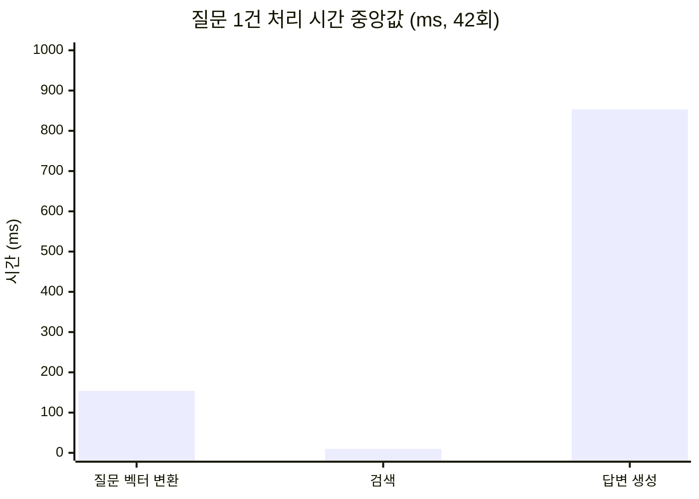

# DocuMind

> PDF 문서를 올리면 그 내용을 근거로 질문에 답하는 문서 질의응답 서비스 (RAG)

<br/>

## 이 프로젝트에서 다룬 것

답변은 OpenAI 모델이 만들지만, 이 프로젝트에서 직접 고민한 부분은 그 앞뒤의 백엔드입니다. 문서를 자르는 방법, 벡터 저장과 검색, 트랜잭션을 어디서 끊을지, 토큰 사용량 기록은 라이브러리에 맡기지 않고 직접 구현했습니다.

| 문제 | 접근 | 결과 |
|---|---|---|
| 청크를 한 건씩 INSERT | 청크 테이블만 ID 생성 방식을 SEQUENCE로 바꾸고 JDBC 배치 사용 | 청크 19건 INSERT가 배치 1회로 실행됨 |
| OpenAI 응답을 기다리는 동안 DB 커넥션을 붙잡음 | API 호출은 트랜잭션 밖에서, 저장만 짧은 트랜잭션으로 | 대기 중 커넥션을 쓰지 않고, 실패해도 작업 기록이 남도록 설계 |
| PDF에서 뽑은 글자가 깨짐 | 깨진 글자를 공백으로 바꾸고 검색 결과 비교 | 검색 순위는 그대로, 화면 표시만 개선 |
| 출력 토큰이 0으로 저장됨 | 빠진 값을 0으로 채우던 코드 제거 | 이후 값이 빠지면 저장 시점에 바로 오류 |
| 유사도 점수로 "문서에 답이 있는지" 판단 | 측정으로 한계를 확인하고 판단을 두 단계로 분리 | 무관한 질문은 모델 호출 없이 거절 |
| 문서에 답이 있는데 "찾을 수 없다"고 답함 | 거절 원인을 답변 단계와 검색 단계로 나눠 확인 | 답변 단계 거절만 프롬프트로 개선, 지어낸 답 0건 유지 |

과정과 근거는 [트러블슈팅](#트러블슈팅)에, 남은 과제는 [진행 예정](#진행-예정)에 있습니다.

<br/>

## 목차

- [기술 스택](#기술-스택)
- [전체 흐름](#전체-흐름)
- [테이블 구성](#테이블-구성)
- [실행 방법](#실행-방법)
- [기능별 구현](#기능별-구현)
- [트러블슈팅](#트러블슈팅)
    - [1. 청크 저장과 ID 생성 방식](#1-청크-저장과-id-생성-방식)
    - [2. 외부 API 호출과 트랜잭션](#2-외부-api-호출과-트랜잭션)
    - [3. PDF에서 뽑은 글자가 깨지는 문제](#3-pdf에서-뽑은-글자가-깨지는-문제)
    - [4. 오류 없이 0으로 저장되던 출력 토큰](#4-오류-없이-0으로-저장되던-출력-토큰)
    - [5. 유사도 점수로는 답이 있는지 알 수 없다](#5-유사도-점수로는-답이-있는지-알-수-없다)
    - [6. 답이 있는데 찾을 수 없다고 답하는 문제](#6-답이-있는데-찾을-수-없다고-답하는-문제)
- [진행 예정](#진행-예정)

<br/>

## 기술 스택

| 구분 | 기술 |
|---|---|
| Language | Java 21 |
| Framework | Spring Boot 4.1.1 |
| Build | Gradle (Groovy DSL) |
| Database | PostgreSQL 17 + pgvector 0.8.6 |
| ORM / Migration | Hibernate 7.4 + hibernate-vector, Flyway |
| Cache | Redis 7 (시맨틱 캐싱에서 사용 예정) |
| LLM Client | Spring AI 2.0.1 (OpenAI API 호출에만 사용) |
| Embedding | text-embedding-3-small (1536차원) |
| Answer | gpt-4o-mini |
| PDF | Apache PDFBox 3.0.7 |
| Frontend | Next.js 16 (App Router), TypeScript, Tailwind CSS |
| Infra | Docker Compose |
| Docs | SpringDoc OpenAPI 3.1.0 |

<br/>

## 전체 흐름

```
[문서 등록]  문서를 올릴 때 한 번
  PDF 업로드
    → 글자 추출     PDFBox, 페이지마다 쪽 번호 표시를 넣어 둠
    → 자르기        정해진 길이 근처의 문장 끝에서 자름
    → 벡터 변환     OpenAI 임베딩 API
    → 저장          청크 본문 + vector(1536)

[질문]  질문할 때마다
  질문
    → 벡터 변환
    → 검색          질문과 가까운 청크 5개
    → 1차 판단      가장 가까운 청크도 기준보다 멀면 모델을 부르지 않음
    → 답변 생성     모델이 청크 내용만 보고 답하거나, 없으면 "찾을 수 없음"
    → 기록          토큰 수와 걸린 시간을 저장
```

### 설계할 때 정한 것

**Spring AI는 API 호출에만 사용했습니다.** Spring AI의 벡터 저장 기능을 쓰면 테이블 생성부터 검색까지 설정 몇 줄로 끝나지만, 그러면 검색 쿼리와 인덱스, 자르는 방법을 직접 다룰 수 없습니다. HTTP 호출과 응답 해석만 맡기고 나머지는 SQL과 코드로 작성했습니다.

**같은 문서를 설정만 바꿔 다시 처리할 수 있게 했습니다.** 청크 길이를 바꿔가며 비교하려면 이전 결과가 지워지면 안 됩니다. 그래서 "문서"와 "처리 1회(job)"를 다른 테이블로 나눴습니다.

**값이 빠지면 조용히 넘어가지 않게 했습니다.** 빠진 값이 0으로 저장되거나 잘못된 설정이 무시되면, 오류는 안 나지만 결과가 틀립니다. 엔티티 필드는 null이 될 수 있는 타입으로 두고 DB의 NOT NULL 제약이 막도록 했고, 설정값은 서버가 뜰 때 검사해서 잘못되면 기동을 멈춥니다.

<br/>

## 테이블 구성

```
documents               원본 파일 정보 + 추출한 글자 (추출은 문서당 한 번)
  └── embedding_jobs    처리 1회 (청크 길이, 겹침 길이, 상태, 진행률, 걸린 시간)
        ├── document_chunks   청크 본문 + vector(1536)
        └── query_logs        질문 1건 (토큰 수, 걸린 시간)
```

<details>
<summary>문서와 처리 기록(job)을 나눈 이유</summary>

<br/>

문서 하나에 청크 묶음 하나만 두면, 청크 길이를 바꿀 때마다 이전 청크를 지워야 합니다. 그러면 500자로 자른 결과와 1000자로 자른 결과를 나란히 비교할 수 없습니다.

job을 나누면 같은 문서에 여러 처리 결과를 함께 둘 수 있습니다. 글자 추출 결과는 `documents`에 한 번만 저장하고 job마다 다시 쓰므로, 설정을 바꿔도 PDF를 다시 읽지 않습니다.

</details>

<details>
<summary>금액 대신 토큰 수를 저장하는 이유</summary>

<br/>

API 단가는 바뀔 수 있습니다. 금액을 저장해 두면 단가가 바뀐 뒤에는 과거 기록이 틀린 값이 됩니다. 토큰 수는 바뀌지 않으니 저장해 두고, 금액은 필요할 때 단가를 곱해서 계산합니다.

입력 토큰과 출력 토큰은 단가가 달라서 따로 저장합니다.

</details>

<details>
<summary>벡터 인덱스를 처음부터 만들지 않은 이유</summary>

<br/>

인덱스를 처음부터 만들면 인덱스가 없을 때와 비교할 수 없습니다. 테이블은 Flyway 마이그레이션으로 만들고, 인덱스는 측정할 때 별도 마이그레이션으로 추가할 예정입니다. 언제 추가했는지가 커밋 기록에 남습니다.

</details>

<br/>

## 실행 방법

### 준비물

Java 21, Docker, Node.js 20.9 이상, pnpm, OpenAI API 키

### 1. DB 띄우기

```bash
docker compose up -d
```

| 컨테이너 | 호스트 포트 | 용도 |
|---|---|---|
| documind-postgres | 5433 | PostgreSQL 17 + pgvector |
| documind-redis | 6381 | 캐시 (예정) |

이미 설치된 PostgreSQL(5432), Redis(6379)와 겹치지 않게 포트를 바꿨습니다. pgvector 확장은 컨테이너가 처음 만들어질 때 켜집니다.

### 2. 백엔드 실행

```bash
export OPENAI_API_KEY=sk-...
./gradlew bootRun
```

API 키는 설정 파일에 적지 않고 환경변수로만 넣습니다.

### 3. 프론트엔드 실행

```bash
cd frontend
pnpm install
pnpm dev
```

http://localhost:3000 에서 열립니다. 프론트엔드는 `/api`로 시작하는 요청을 백엔드(8080)로 넘겨주도록 설정되어 있어서, 브라우저는 3000번 주소로만 요청합니다. 백엔드 주소는 `BACKEND_URL` 환경변수로 바꿀 수 있습니다.

### 4. 샘플 문서 등록

`sample-data/`의 PDF는 테스트용으로 만든 가상의 사내 규정집입니다. 문서 업로드와 처리는 아직 화면이 없어서 curl로 합니다.

```bash
# 업로드 → 문서 ID 확인
curl -sS -X POST http://localhost:8080/api/documents \
  -F "file=@sample-data/nurisolution-handbook-2026.pdf" | jq '.data.id'

# 자르기 + 벡터 변환 → job ID 확인
curl -sS -X POST http://localhost:8080/api/documents/{문서ID}/jobs \
  -H "Content-Type: application/json" \
  -d '{"chunkSize": 500, "chunkOverlap": 50}' | jq '.data'
```

그다음 화면에서 문서와 처리 설정을 고르고 질문하면 됩니다.

### 5. 평가 스크립트

질문 14개를 한 번에 보내고 결과를 CSV로 저장합니다.

```bash
python3 scripts/eval/run_eval.py --job-id {jobID} --repeat 3
```

### API 문서

http://localhost:8080/swagger-ui.html

<br/>

## 기능별 구현

### 문서 등록

| Method | Endpoint | 설명 |
|---|---|---|
| POST | `/api/documents` | PDF 업로드, 글자 추출 |
| GET | `/api/documents` | 문서 목록 (추출한 글자는 빼고 조회) |

- 파일 내용으로 SHA-256 해시를 만들어 같은 파일을 다시 올리면 막습니다. 디스크에 쓰기 전에 먼저 확인합니다.
- 해시는 파일을 조금씩 읽으면서 계산해서, 큰 파일도 메모리를 많이 쓰지 않습니다.
- 저장 파일명은 UUID로 바꾸고, DB에는 저장 폴더 기준의 상대 경로만 남깁니다.
- 페이지마다 쪽 번호 표시를 넣어 두고, 나중에 각 청크가 몇 쪽에서 왔는지 찾는 데 씁니다.
- 글자를 뽑을 수 없는 PDF(스캔한 이미지 등)는 업로드할 때 거부합니다.

### 자르기와 벡터 변환

| Method | Endpoint | 설명 |
|---|---|---|
| POST | `/api/documents/{id}/jobs` | 청크 길이를 정해 처리 시작 (현재는 끝날 때까지 기다림) |
| GET | `/api/documents/{id}/jobs` | 문서의 처리 기록 목록 |
| GET | `/api/jobs/{id}` | 처리 상태와 진행률 |

- 정해진 길이 근처에서 문단 끝, 문장 끝, 줄 끝, 띄어쓰기 순으로 자를 곳을 찾습니다.
- PDF의 줄바꿈은 문장이 끝나서가 아니라 줄이 꽉 차서 생긴 경우가 많아서, 문장 끝을 줄바꿈보다 먼저 봅니다.
- 청크가 너무 짧아지지 않게 최소 길이를 두고, 겹침 길이는 청크 길이의 절반보다 작게 제한합니다. 이 제한이 없으면 같은 위치를 계속 자르는 무한 반복이 생길 수 있습니다.
- 임베딩 API 응답은 보낸 순서대로 온다고 가정하지 않고, 응답에 담긴 순번으로 청크와 벡터를 짝짓습니다.

<details>
<summary>자르는 코드가 DB를 모르게 만든 이유</summary>

<br/>

`TextChunker`는 문자열을 받아 잘린 조각 목록을 돌려주기만 합니다. 엔티티나 DB를 모르기 때문에 DB 없이 단위 테스트로 확인할 수 있고, 자르는 방법을 바꿀 때 저장 코드를 건드리지 않습니다.

</details>

### 검색

| Method | Endpoint | 설명 |
|---|---|---|
| POST | `/api/jobs/{id}/search` | 질문과 가까운 청크 조회 (답변 생성 없음) |

```sql
SELECT c.id, c.chunk_index, c.page_number, c.content,
       1 - (c.embedding <=> CAST(:queryVector AS vector)) AS similarity
FROM document_chunks c
WHERE c.job_id = :jobId
  AND c.embedding IS NOT NULL
ORDER BY c.embedding <=> CAST(:queryVector AS vector)
LIMIT :topK
```

- `<=>`는 pgvector의 코사인 거리 연산자입니다. OpenAI 임베딩은 길이가 1로 맞춰져 있어서 다른 거리 계산을 써도 순위는 같지만, `1 - 거리`로 유사도를 바로 읽을 수 있어서 이걸 골랐습니다.
- 정렬은 "유사도가 큰 순"이 아니라 "거리가 짧은 순"으로 썼습니다. pgvector 인덱스는 이 형태의 쿼리에서 쓰이기 때문에, 나중에 인덱스를 추가해도 쿼리를 고치지 않아도 됩니다.
- 이 연산자는 JPQL에 없어서 `JdbcClient`로 SQL을 직접 씁니다.
- 벡터 열은 조회 결과에서 뺐습니다. 행마다 숫자 1536개를 주고받을 필요가 없습니다.

<details>
<summary>인덱스가 없을 때의 실행 계획</summary>

<br/>

```
Limit  (actual time=0.312..0.313 rows=3 loops=1)
  ->  Sort
        Sort Key: (embedding <=> 질문 벡터)
        Sort Method: top-N heapsort  Memory: 25kB
        ->  Seq Scan on document_chunks
              Filter: (job_id = 5)
              Rows Removed by Filter: 36
Execution Time: 0.814 ms
```

실제 출력에서 이해에 필요한 줄만 남겼습니다.

테이블을 처음부터 끝까지 읽어서(`Seq Scan`) 해당 job의 청크 전부와 거리를 계산한 뒤, 가까운 3개만 남깁니다. 정렬은 상위 몇 개만 챙기는 방식이라 빠르지만, 거리 계산은 청크 수만큼 해야 합니다. HNSW 인덱스로 줄이려는 부분이 이 계산입니다.

</details>

### 질문과 답변

| Method | Endpoint | 설명 |
|---|---|---|
| POST | `/api/jobs/{id}/ask` | 검색 → 판단 → 답변 → 기록 |

- 모델에게 "보내준 청크 내용만 근거로 답하고, 없으면 정해진 문장으로 답하라"고 지시합니다.
- 답변 문장 끝에 근거가 된 청크 번호(`[1]`, `[2]`)를 붙이게 하고, 응답에 각 번호의 쪽수와 유사도를 함께 담습니다.
- 문서 안에 "앞의 지시를 무시하라" 같은 문장이 있어도 따르지 않도록 지시합니다.
- 문서 본문의 중괄호(`{}`)가 템플릿 문법으로 해석되지 않게, 템플릿 기능을 거치지 않고 메시지를 직접 만듭니다.
- 벡터 변환, 검색, 답변 생성, 전체 시간을 따로 재서 응답과 로그에 남깁니다.


```mermaid
xychart-beta
    title "질문 1건 처리 시간 중앙값 (ms, 42회)"
    x-axis ["질문 벡터 변환", "검색", "답변 생성"]
    y-axis "시간 (ms)" 0 --> 1000
    bar [153.9, 10.0, 853.2]
```

전체 시간의 중앙값은 1,028ms이고 그중 검색은 10ms입니다. 지금 규모에서는 기다리는 시간 대부분이 OpenAI 호출입니다. (샘플 규정집, 청크 19개, 질문 14개 × 3회. 모델을 부르지 않은 3회도 포함되어 답변 생성 중앙값은 실제보다 조금 낮게 나옵니다.)

### 화면

- 왼쪽에서 문서와 처리 설정을 고르고, 오른쪽에서 채팅하듯 질문합니다.
- 답변 옆에 출처가 바인더 색인처럼 붙어 나오고, 쪽수가 적혀 있습니다. 답변 속 번호나 색인을 누르면 해당 출처가 노란색으로 표시됩니다.
- 토큰 수와 단계별 시간은 답변 아래 "처리 정보"를 펼치면 보입니다.
- 한글을 입력하다 Enter를 누르면 질문이 두 번 전송되는 문제가 있어서, 글자 조합 중인지 확인한 뒤 보냅니다.
- 서버는 이전 질문을 기억하지 않기 때문에, 빈 화면에 "매번 완전한 문장으로 물어보세요"라고 안내합니다.

### 오류 응답

| 범위 | 코드 | 예시 |
|---|---|---|
| 공통 | `C001`~`C004` | 입력값 오류, JSON 형식 오류, 없는 주소 |
| 문서 | `D001`~`D013` | 같은 파일 재업로드, 암호 걸린 PDF, 글자 추출 불가, 임베딩 실패 |
| 질문 | `Q001` | 답변 생성 실패 |

- HTTP 상태 코드는 오류의 큰 분류를, 자체 코드는 정확한 원인을 알려줍니다. 화면은 자체 코드를 보고 메시지를 정합니다.
- 사용자 실수(4xx)는 로그를 한 줄만, 서버 문제(5xx)는 스택 트레이스까지 남깁니다.
- OpenAI 쪽 실패는 502로 응답해서 문제가 우리 서버 밖에 있다는 걸 구분합니다.
- 잘못된 JSON이나 없는 주소처럼 Spring이 직접 내는 오류도 자체 코드를 거치게 해서, 사용자 실수가 500으로 응답되지 않게 했습니다.

<br/>

---

<br/>

# 트러블슈팅

<br/>

## 1. 청크 저장과 ID 생성 방식

### 문제 상황

문서 하나에서 청크가 수천 개 나올 수 있습니다. 청크마다 INSERT를 따로 보내면 DB와 그만큼 주고받아야 합니다.

Hibernate는 여러 INSERT를 묶어서 보내는 배치 기능이 있지만, ID를 DB가 INSERT 때 정해주는 IDENTITY 방식에서는 쓸 수 없습니다. 저장할 때마다 INSERT를 바로 실행해서 ID를 받아와야 하기 때문입니다.

### 해결 과정

많이 저장되는 `document_chunks`만 SEQUENCE 방식으로 바꿨습니다. SEQUENCE는 ID를 미리 50개씩 받아둘 수 있어서, INSERT를 모아뒀다가 한 번에 보낼 수 있습니다.

```sql
CREATE SEQUENCE document_chunks_seq START 1 INCREMENT 50;
```

```java
@GeneratedValue(strategy = GenerationType.SEQUENCE, generator = "documentChunksSeq")
@SequenceGenerator(name = "documentChunksSeq", sequenceName = "document_chunks_seq",
                   allocationSize = 50)   // SQL의 INCREMENT와 같아야 함
private Long id;
```

```yaml
spring.jpa.properties.hibernate:
  jdbc.batch_size: 50
  order_inserts: true
```

- 배치 크기를 시퀀스가 한 번에 주는 개수와 같은 50으로 맞췄습니다.
- `order_inserts`는 같은 테이블의 INSERT끼리 모아서 배치가 중간에 끊기지 않게 합니다.
- 건수가 적은 나머지 테이블은 IDENTITY를 그대로 뒀습니다.

### 확인하다 막힌 부분

배치로 나갔는지는 SQL 로그로 알 수 없습니다. 묶여서 나가도 SQL 로그는 문장마다 한 줄씩 찍히기 때문입니다. Hibernate 세션 통계의 배치 횟수를 봐야 합니다.

그런데 `generate_statistics: true`를 켜도 통계가 나오지 않았습니다. Hibernate 소스를 확인해 보니, 이 버전에서는 세션 통계를 `org.hibernate.session.metrics` 로거의 DEBUG 레벨로 출력합니다. 예전 버전 기준의 자료를 보고 INFO 레벨로 나올 거라고 생각했던 것이 원인이었습니다.

```yaml
logging.level:
  org.hibernate.session.metrics: debug
```

### 측정 결과

샘플 규정집을 500자로 잘라 청크 19개를 저장한 요청의 통계입니다.

```
360000 ns preparing 5 JDBC statements
11809793 ns executing 3 JDBC statements
7835625 ns executing 2 JDBC batches
16874708 ns executing 1 flushes (flushing a total of 21 entities and 0 collections)
```

저장한 엔티티 21개는 문서 1개, job 1개, 청크 19개입니다. 서비스 코드의 흐름으로 맞춰보면 SQL 5개는 이렇게 나뉩니다.

| 순서 | SQL | 실행 |
|---|---|---|
| 1 | 문서 조회 | 한 건씩 |
| 2 | job INSERT | 한 건씩 (IDENTITY) |
| 3 | 시퀀스에서 ID 받기 | 한 건씩 |
| 4 | 청크 INSERT × 19 | 배치 |
| 5 | job UPDATE | 배치 |

같은 INSERT인데 job은 한 건씩, 청크는 배치로 나갔습니다. 둘의 차이는 ID 생성 방식뿐입니다.

### 결론

> ID 생성 방식이 배치 INSERT 가능 여부를 정합니다. 많이 저장되는 테이블에 IDENTITY를 쓰면 배치 설정을 켜도 효과가 없습니다.

청크 19개로는 시간 차이를 재기 어려워서, 큰 문서로 두 방식의 저장 시간을 비교하는 건 비동기 처리 작업에서 진행합니다.

<br/>

---

<br/>

## 2. 외부 API 호출과 트랜잭션

### 문제 상황

벡터 변환은 OpenAI 서버에 요청을 보내고 응답을 기다려야 합니다. 처음에는 청크 저장부터 벡터 저장까지 `@Transactional` 하나로 묶으려 했는데, 두 가지 문제가 있었습니다.

첫째, 응답을 기다리는 동안 트랜잭션이 열려 있으면 DB 커넥션을 계속 쓰고 있게 됩니다. 커넥션 개수는 정해져 있어서 동시 요청이 몇 개만 겹쳐도 모자랄 수 있습니다.

둘째, 중간에 실패하면 job을 만든 것까지 전부 취소됩니다. 사용자가 작업을 조회하면 "실패"가 아니라 "없음"이 나옵니다.

### 해결 과정

OpenAI 호출은 트랜잭션 밖에서 하고, DB에 쓸 때만 짧게 트랜잭션을 열도록 나눴습니다.

```
[트랜잭션 1]  job 생성, 자르기, 청크 저장
[트랜잭션 2]  상태를 EMBEDDING으로, 청크 본문 읽기
반복 {
    [트랜잭션 없음]  OpenAI 호출 (100개씩)
    [트랜잭션 N]     벡터 저장, 진행률 증가
}
[마지막]  COMPLETED
실패하면  [별도 트랜잭션]  FAILED 기록
```

- 묶음마다 커밋하기 때문에 처리 중에도 진행률 조회에 바로 반영됩니다.
- 중간에 실패해도 앞에서 이미 비용을 내고 받은 벡터는 남아 있습니다.

`@Transactional` 대신 `TransactionTemplate`을 쓴 이유도 있습니다. `@Transactional`은 Spring이 객체를 한 번 감싸서 동작하기 때문에, 같은 클래스 안에서 다른 메서드를 부르면 적용되지 않습니다. 메서드 하나 안에서 트랜잭션을 여러 번 열고 닫아야 해서, 코드로 직접 경계를 정하는 `TransactionTemplate`을 썼습니다.

### 결론

> OpenAI 호출과 DB 트랜잭션을 분리했습니다. 대신 "청크는 있는데 벡터는 일부만 있는" 중간 상태가 생길 수 있어서, 이 상태를 job의 상태 값과 진행률로 드러냈습니다.

실패했을 때 FAILED가 실제로 남는지는 아직 확인하지 않았습니다. Rate Limit 대응 작업에서 오류 종류별로 함께 확인합니다.

<br/>

---

<br/>

## 3. PDF에서 뽑은 글자가 깨지는 문제

### 문제 상황

검색 결과에 `인증�보안`, `조직�권한`처럼 깨진 글자가 섞여 나왔습니다.

`�`는 원래 글자를 알 수 없을 때 들어가는 대체 문자입니다. PDF는 글자를 "이 글꼴의 몇 번째 모양"으로 저장하고, 그 모양이 어떤 글자인지는 따로 적어 둡니다. 그 정보가 빠진 모양은 글자를 뽑을 때 원래 글자를 알 수 없습니다.

### 원인 분석

깨진 글자가 얼마나 되는지 DB에서 셌습니다.

```sql
SELECT length(extracted_text) - length(replace(extracted_text, E'\uFFFD', '')) AS broken_chars
FROM documents;
```

| 전체 글자 | 깨진 글자 | 비율 |
|---|---|---|
| 3,722 | 90 | 2.4% |

개발 초기에 쓴 테스트 문서(공개하지 않음) 기준입니다. 깨진 곳은 대부분 항목을 나열할 때 쓰는 구분 기호 자리였습니다.

### 해결 과정

원래 글자를 짐작해서 채우지 않고 공백으로 바꿨습니다. 이 문서에서는 가운뎃점으로 보였지만, 모든 PDF가 그렇다고 볼 수 없어서입니다. 바꾼 개수와 비율은 경고 로그로 남겨서, 깨진 글자가 많은 PDF를 알아볼 수 있게 했습니다.

### 측정 결과

바꾸기 전 청크와 바꾼 뒤 청크에 같은 질문을 보냈습니다.

| 순위 | 바꾸기 전 | 바꾼 뒤 | 차이 |
|---|---|---|---|
| 1위 | 0.4749 | 0.4623 | -0.0126 |
| 2위 | 0.4388 | 0.4372 | -0.0016 |
| 3위 | 0.3722 | 0.3723 | +0.0001 |

세 청크가 같은 순서로 나왔고 유사도 차이는 0.01 정도였습니다. 검색이 좋아질 거라고 예상했지만 1위는 오히려 조금 낮아졌습니다.

### 결론

> 깨진 글자를 고쳐도 이 문서의 검색 결과는 바뀌지 않았습니다. 이 수정으로 얻은 건 답변과 출처에 깨진 글자가 보이지 않는 것입니다.

샘플 규정집은 글자 정보가 들어 있는 글꼴로 만들었고, 업로드할 때 경고 로그가 나오지 않는 것으로 깨진 글자가 없음을 확인했습니다.

<br/>

---

<br/>

## 4. 오류 없이 0으로 저장되던 출력 토큰

### 문제 상황

질문 API 응답에는 출력 토큰이 69로 나왔는데, `query_logs` 테이블에는 0으로 저장되어 있었습니다.

| 기록 번호 | 응답의 출력 토큰 | DB의 출력 토큰 |
|---|---|---|
| 3 | 69 | 0 |
| 4 | 10 | 0 |

입력 토큰은 맞게 저장됐고, 어디에서도 오류가 나지 않았습니다.

### 원인 분석

직접적인 원인은 빌더에서 한 줄이 빠진 것이었습니다.

```java
QueryLog.builder()
        .promptTokens(generation.promptTokens())
        // .completionTokens(...) 빠짐
        .latencyMs(totalMs)
        .build();
```

그런데 더 큰 원인은 엔티티 생성자에 있었습니다.

```java
this.completionTokens = completionTokens != null ? completionTokens : 0;
```

`completion_tokens` 컬럼은 NOT NULL입니다. 이 코드가 없었다면 빠진 값이 null로 저장되려다 바로 오류가 났을 겁니다. 편하려고 넣은 기본값이 실수를 가렸습니다.

엔티티 필드를 null이 될 수 있는 타입으로 둔 건 "빠진 값이 조용히 0이 되지 않게" 하려는 것이었는데, 생성자에서 직접 0으로 바꾸고 있었습니다.

### 해결 과정

빠진 빌더 호출을 추가하고, 생성자의 기본값 처리도 지웠습니다.

```java
this.completionTokens = completionTokens;
```

모델을 부르지 않은 경우의 0은 호출하는 쪽에서 직접 넘기고 있어서, 생성자의 기본값은 처음부터 필요 없었습니다. 생성자 파라미터를 `int` 같은 기본 타입으로 바꾸면 빌더가 빠진 값을 0으로 채워서 같은 문제가 다시 생기므로, `Integer`를 유지했습니다.

### 결론

> 빠진 값을 0으로 채우지 않고 저장할 때 오류가 나도록 바꿨습니다. 이제 빌더 호출이 빠지면 첫 요청에서 바로 알 수 있습니다.

API 응답과 DB 기록을 나란히 놓고 보다가 발견했습니다. 확인하지 않았다면 비용을 계산할 때 출력 토큰이 전부 빠졌을 겁니다.

<br/>

---

<br/>

## 5. 유사도 점수로는 답이 있는지 알 수 없다

### 문제 상황

벡터 검색은 문서와 상관없는 질문에도 항상 결과를 돌려줍니다. "관련 있는 것"이 아니라 "그나마 가장 가까운 것"을 찾기 때문입니다. 이런 질문까지 모델에 보내면 비용이 들고, 모델이 엉뚱한 답을 만들 수도 있습니다.

처음에는 가장 가까운 청크의 유사도가 기준보다 낮으면 "답이 없다"고 처리하려 했습니다.

### 측정 결과

샘플 규정집에 질문을 보내고 가장 가까운 청크의 유사도를 봤습니다.

| 질문 | 문서에 답이 있나 | 1위 유사도 |
|---|---|---|
| 입사 1년이 지나면 연차가 며칠이야? | 있음 | 0.516 |
| 밤늦게까지 일하면 저녁값 지원돼? | 있음 | 0.282 |
| 밤 10시 넘어서 퇴근하면 택시비 나와? | 있음 | 0.280 |
| 회사에서 주차 지원해 줘? | 없음 | 0.321 |
| 사내 식당은 몇 시에 열어? | 없음 | 0.290 |

문서에 답이 없는 "주차 지원"(0.321)이 답이 있는 "저녁값"(0.282)보다 유사도가 높습니다. 어떤 기준을 잡아도 둘을 제대로 나눌 수 없습니다.

### 해결 과정

판단을 두 단계로 나눴습니다.

| 단계 | 방법 | 목적 |
|---|---|---|
| 1차 | 1위 유사도가 낮은 기준(0.25)보다 낮으면 모델을 부르지 않음 | 명백히 상관없는 질문의 비용 줄이기 |
| 2차 | 모델이 청크 내용을 읽고, 답이 없으면 정해진 문장으로 답함 | 실제로 답이 있는지 판단 |

기준을 낮게 잡은 이유는 두 가지 실수의 무게가 다르기 때문입니다. 답이 있는 질문을 1차에서 막으면 사용자는 문서에 있는 내용을 받지 못합니다. 반대로 답이 없는 질문을 통과시키면 모델 호출 비용이 조금 더 들 뿐입니다. 위 표에서도 0.3으로 올렸다면 답이 있는 두 질문이 1차에서 막혔을 겁니다.

"오늘 점심 메뉴 추천해줘"는 1차에서 걸러졌습니다. 모델을 부르지 않았으니 입력 토큰 0개, 162ms로 끝났습니다. 같은 "찾을 수 없음" 답이라도 2차까지 간 "주차 지원"은 입력 토큰 1,679개, 1,000ms가 들었습니다.

### 남은 문제

2차까지 간 "답 없음"도 실제 답변과 비슷한 양의 입력 토큰을 씁니다. 청크 5개를 모델에 보내기 때문입니다. 1차 기준만으로 줄일 수 있는 비용은 크지 않아서, 비슷한 질문의 답을 다시 쓰는 캐싱이 비용을 줄이는 데 더 효과가 있을 것으로 보고 있습니다.

<br/>

---

<br/>

## 6. 답이 있는데 찾을 수 없다고 답하는 문제

### 문제 상황

평가 스크립트로 샘플 규정집에 질문 10개를 한 번씩 보냈습니다. 문서에 답이 있는 질문 중 2개에 "문서에서 관련 내용을 찾을 수 없습니다"라고 답했습니다.

| 질문 | 문서 내용 |
|---|---|
| 밤늦게까지 일하면 저녁값 지원돼? | 오후 9시 이후 근무 시 1회 1만 2천 원의 야근 식대 |
| 병가 중에 돈 받는 날은 며칠이야? | 병가 30일 중 10일은 유급 |

모델이 지어낸 답은 없었지만, 있는 답을 못 주는 것도 문제입니다.

### 원인 분석

거절에는 두 가지 경우가 있을 수 있습니다.

| 경우 | 의미 | 고칠 곳 |
|---|---|---|
| 검색 실패 | 정답이 든 청크가 모델에 전달되지 않음 | 자르는 방법, 검색 |
| 답변 단계 거절 | 정답이 든 청크를 받고도 거절 | 프롬프트 |

어느 쪽인지 알려면 정답이 든 청크가 검색 결과 5개 안에 있었는지 보면 됩니다. 먼저 DB에서 정답 문구가 들어 있는 청크 번호를 찾았습니다.

```sql
SELECT chunk_index
FROM document_chunks
WHERE job_id = 7 AND content LIKE '%야근 식대%';
```

그리고 같은 질문으로 검색 API를 불러 상위 5개의 청크 번호와 비교했습니다. 이때 쪽 번호만 보고 판단하면 안 됩니다. 쪽 번호는 청크가 시작하는 쪽이고, 청크 하나에 여러 조항이 들어 있기 때문입니다.

확인하는 김에 새 질문 4개를 추가했습니다. 프롬프트를 고치면서 이 두 질문만 보고 맞추면, 이 두 질문에만 통하는 수정이 될 수 있어서입니다. 새 질문은 수정할 때 보지 않고 결과 확인에만 썼습니다.

| 질문 | 정답이 든 청크 | 검색 상위 5개 안에 있었나 | 원인 |
|---|---|---|---|
| 저녁값 지원 | 7 | 2위 | 답변 단계 거절 |
| 병가 유급 | 4 | 5위 | 답변 단계 거절 |
| 택시비 (새 질문) | 7 | 없음 | 검색 실패 |
| 생일 조퇴 (새 질문) | 9 | 없음 | 검색 실패 |

겉으로는 같은 "찾을 수 없음"이었지만 원인이 둘로 나뉘었습니다.

같은 청크 7에 야근 식대와 택시비 조항이 함께 들어 있는데, "저녁값"으로 물으면 2위로 찾고 "퇴근하면 택시비"로 물으면 5위 안에도 들지 못했습니다. 문서에 내용이 없어서가 아니라 질문의 표현에 따라 찾기도 하고 못 찾기도 했습니다.

### 해결 과정

답변 단계 거절은 프롬프트의 이 문장 때문일 수 있다고 봤습니다.

```
발췌에 답이 없으면 추측하지 말고 "문서에서 관련 내용을 찾을 수 없습니다."라고만 답한다.
```

"저녁값"과 "야근 식대"를 같은 것으로 연결하는 것까지 추측으로 받아들였을 수 있습니다. 거절하는 조건을 좁히고, 표현이 다른 것만으로는 거절하지 말라고 적었습니다.

```
질문과 발췌의 표현이 달라도 가리키는 대상이 같으면 발췌에 답이 있는 것으로 본다.
발췌에 질문과 관련된 근거가 전혀 없을 때만 "문서에서 관련 내용을 찾을 수 없습니다."라고만 답한다.
```

"발췌 내용만 근거로 답한다"는 문장은 그대로 뒀습니다. 이 문장이 모델이 답을 지어내지 못하게 막습니다. 프롬프트에 "저녁값" 같은 평가 질문의 단어를 예시로 넣지도 않았습니다. 넣으면 그 질문만 통과하게 만드는 것이 됩니다.

### 측정 결과

모델은 같은 질문에도 매번 조금씩 다르게 답할 수 있어서, 고치기 전과 후를 각각 질문 14개 × 3회로 돌렸습니다.

| 질문 | 원인 | 고치기 전 | 고친 후 |
|---|---|---|---|
| 저녁값 지원 | 답변 단계 | 3번 중 2번 통과 | 3번 모두 통과 |
| 병가 유급 | 답변 단계 | 3번 중 2번 통과 | 3번 모두 통과 |
| 택시비 | 검색 실패 | 0번 | 0번 |
| 생일 조퇴 | 검색 실패 | 0번 | 0번 |
| 답이 없는 질문 3개 | | 9번 모두 거절 | 9번 모두 거절 |

| 지표 | 고치기 전 | 고친 후 |
|---|---|---|
| 답이 있는 질문 통과 (33회 중) | 25회 (76%) | 27회 (82%) |
| 답이 있는데 거절 | 8회 | 6회 |
| 답이 없는데 지어낸 답 | 0회 | 0회 |
| 입력 토큰 합계 | 63,858 | 65,262 |

입력 토큰이 1,404개 늘었는데, 모델을 부른 39회 × 프롬프트에 늘어난 36토큰과 정확히 같습니다.

### 측정하면서 알게 된 것

처음 한 번 돌렸을 때는 "저녁값"과 "병가"가 둘 다 거절됐습니다. 그 결과만 보고 비교했다면 "0번에서 3번으로 고쳤다"고 적었을 겁니다. 그런데 고치기 전 프롬프트로 세 번 돌려보니 원래도 3번 중 2번은 통과하고 있었습니다. 첫 결과는 하필 거절이 나온 경우였습니다.

그래서 이 수정은 거절을 없앤 게 아니라, 통과와 거절 사이에서 흔들리던 두 질문을 매번 통과하게 만든 것입니다. 한 번만 돌린 결과를 기준으로 삼으면 효과를 부풀리게 됩니다.

### 결론

> 같은 "찾을 수 없음"도 원인이 다르면 고칠 곳이 다릅니다. 모델이 받지 못한 내용은 프롬프트로 끌어낼 수 없어서, 검색 실패 2건은 프롬프트를 바꿔도 전혀 달라지지 않았습니다.

검색 실패 2건은 자르는 방법을 바꾸는 실험에서 다룹니다. 두 질문 모두 "퇴근"이라는 단어가 들어가는데, 검색 결과에 출퇴근 시간 조항이 반복해서 나왔습니다. 질문의 의도보다 단어에 끌려간 것으로 보고 확인할 예정입니다.

<br/>

---

<br/>

# 진행 예정

| 작업 | 내용 | 확인할 것 |
|---|---|---|
| 자르는 방법 실험 | 청크 길이·겹침 길이를 바꾸고, 조항 단위로 자르는 방식과 비교 | 통과율, 검색 실패 2건(택시비, 생일 조퇴) 해결 여부, 입력 토큰 |
| 비동기 처리 | 큰 문서의 벡터 변환을 요청과 분리하고 진행률 조회, 업로드·진행률 화면 추가 | 요청 응답 시간, 전체 처리 시간 |
| Rate Limit 대응 | 다시 시도하면 되는 오류(429)와 다시 해도 안 되는 오류(잔액 부족) 구분 | 재시도 횟수, 실패율, 실패 시 FAILED 기록 |
| 시맨틱 캐싱 | 비슷한 질문의 답을 다시 쓰기, 화면에 캐시 사용 여부와 비용 표시 | 캐시 적중률, 줄어든 토큰 |
| HNSW 인덱스 | 청크가 많을 때 인덱스 전후 비교 | 검색 시간, 정답 청크를 놓치는 비율 |
