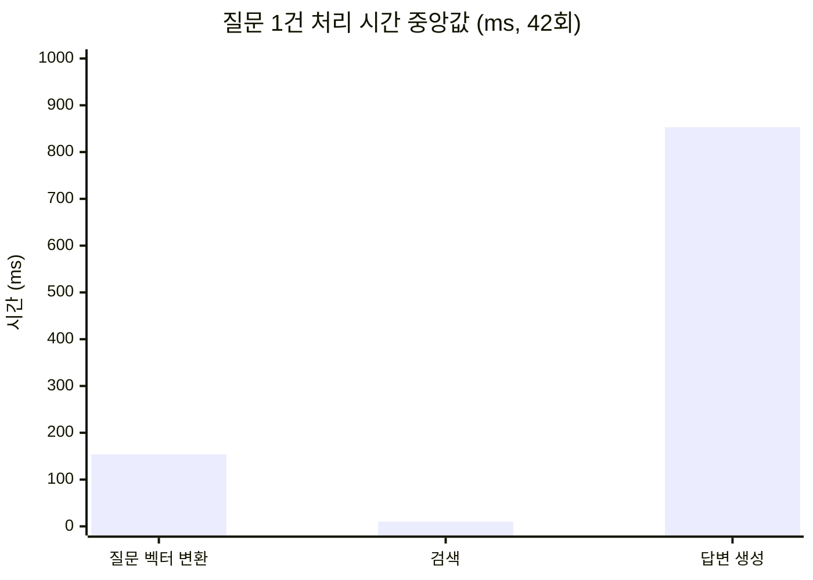

# DocuMind

> PDF 문서를 올리면 그 내용을 근거로 질문에 답하는 문서 질의응답 서비스 (RAG)

<br/>

## 이 프로젝트에서 다룬 것

답변은 OpenAI 모델이 만들지만, 이 프로젝트에서 직접 고민한 부분은 그 앞뒤의 백엔드입니다. 문서를 자르는 방법, 벡터 저장과 검색, 트랜잭션을 어디서 끊을지, 토큰 사용량 기록은 라이브러리에 맡기지 않고 직접 구현했습니다.

| 문제 | 접근 | 결과 |
|---|---|---|
| 청크를 한 건씩 INSERT | 청크 테이블만 ID 생성 방식을 SEQUENCE로 바꾸고 JDBC 배치 사용 | 청크 1,082건을 INSERT 배치 22회로 저장 (flush 67ms) |
| OpenAI 응답을 기다리는 동안 DB 커넥션을 붙잡음 | API 호출은 트랜잭션 밖에서, 저장만 짧은 트랜잭션으로 | 대기 중 커넥션을 쓰지 않고, 실패해도 작업 기록이 남도록 설계 |
| PDF에서 뽑은 글자가 깨짐 | 깨진 글자를 공백으로 바꾸고 검색 결과 비교 | 검색 순위는 그대로, 화면 표시만 개선 |
| 출력 토큰이 0으로 저장됨 | 빠진 값을 0으로 채우던 코드 제거 | 이후 값이 빠지면 저장 시점에 바로 오류 |
| 유사도 점수로 "문서에 답이 있는지" 판단 | 측정으로 한계를 확인하고 판단을 두 단계로 분리 | 무관한 질문은 모델 호출 없이 거절 |
| 문서에 답이 있는데 "찾을 수 없다"고 답함 | 거절 원인을 답변 단계와 검색 단계로 나눠 확인 | 답변 단계 거절만 프롬프트로 개선, 지어낸 답 0건 유지 |
| 글자 수로 자르면 조항이 쪼개지거나 다른 조항과 섞임 | 조항 단위로 자르고, 모델에 보낼 양을 개수 대신 글자 수로 맞춤 | 같은 양을 보냈을 때 통과율 73% → 100%, 틀린 답 0건 |
| 큰 문서를 처리하는 동안 요청이 붙잡혀 있음 | 처리를 전용 스레드 풀로 넘기고 job 번호만 바로 응답 | 응답 5.29초 → 0.017초, 강제 종료 후에도 멈춘 작업이 정리됨 |
| OpenAI가 실패하면 원인과 상관없이 같은 실패로 끝나고 처음부터 다시 해야 함 | 원인별 분류, 남은 청크부터 이어서 처리, 문서 처리만 길게 기다리는 재시도, 배치 동시 전송 | 중단 후 이어서 처리해도 중복 토큰 0, 처리 시간 5.5초 → 1.4초 |

과정과 근거는 [트러블슈팅](#트러블슈팅)에, 남은 과제는 [진행 예정](#진행-예정)에 있습니다.

<br/>

## 목차

- [기술 스택](#기술-스택)
- [전체 흐름](#전체-흐름)
- [테이블 구성](#테이블-구성)
- [실행 방법](#실행-방법)
- [기능별 구현](#기능별-구현)
- [트러블슈팅](#트러블슈팅)
    - [1. 청크 저장과 ID 생성 방식](#1-청크-저장과-id-생성-방식)
    - [2. 외부 API 호출과 트랜잭션](#2-외부-api-호출과-트랜잭션)
    - [3. PDF에서 뽑은 글자가 깨지는 문제](#3-pdf에서-뽑은-글자가-깨지는-문제)
    - [4. 오류 없이 0으로 저장되던 출력 토큰](#4-오류-없이-0으로-저장되던-출력-토큰)
    - [5. 유사도 점수로는 답이 있는지 알 수 없다](#5-유사도-점수로는-답이-있는지-알-수-없다)
    - [6. 답이 있는데 찾을 수 없다고 답하는 문제](#6-답이-있는데-찾을-수-없다고-답하는-문제)
    - [7. 청크를 어떻게 자르고, 얼마나 보낼까](#7-청크를-어떻게-자르고-얼마나-보낼까)
    - [8. 큰 문서를 처리하는 동안 요청이 붙잡혀 있는 문제](#8-큰-문서를-처리하는-동안-요청이-붙잡혀-있는-문제)
    - [9. OpenAI가 실패할 때: 구분하고, 기다리고, 이어서 처리하기](#9-openai가-실패할-때-구분하고-기다리고-이어서-처리하기)
- [진행 예정](#진행-예정)

<br/>

## 기술 스택

| 구분 | 기술 |
|---|---|
| Language | Java 21 |
| Framework | Spring Boot 4.1.1 |
| Build | Gradle (Groovy DSL) |
| Database | PostgreSQL 17 + pgvector 0.8.6 |
| ORM / Migration | Hibernate 7.4 + hibernate-vector, Flyway |
| Cache | Redis 7 (시맨틱 캐싱에서 사용 예정) |
| LLM Client | Spring AI 2.0.1 (OpenAI API 호출에만 사용) |
| Embedding | text-embedding-3-small (1536차원) |
| Answer | gpt-4o-mini |
| PDF | Apache PDFBox 3.0.7 |
| Frontend | Next.js 16 (App Router), TypeScript, Tailwind CSS |
| Infra | Docker Compose |
| Docs | SpringDoc OpenAPI 3.1.0 |

<br/>

## 전체 흐름

```
[문서 등록]  문서를 올릴 때 한 번
  PDF 업로드
    → 글자 추출     PDFBox, 페이지마다 쪽 번호 표시를 넣어 둠
  처리 작업 생성    job 번호만 받고 요청은 바로 끝남 (202)
    → 자르기        "제N조" 단위로 자름 (조항이 없는 문서는 정해진 길이 근처의 문장 끝)
    → 벡터 변환     OpenAI 임베딩 API, 100개씩 묶어 4묶음까지 동시에
                    (요청 한도 초과·일시 오류면 10초 → 20초 → 40초 기다렸다가 그 묶음만 다시)
    → 저장          청크 본문 + vector(1536), 100개마다 커밋
                    (자르기부터 저장까지는 전용 작업 스레드에서 실행)
  진행률 조회       job 번호로 상태와 진행률 확인
  이어서 처리       다시 해도 되는 실패면, 벡터가 없는 청크부터 이어서 처리

[질문]  질문할 때마다
  질문
    → 벡터 변환
    → 검색          질문과 가까운 청크 20개
    → 발췌 고르기    가까운 순서대로 2,000자까지
    → 1차 판단      가장 가까운 청크도 기준보다 멀면 모델을 부르지 않음
    → 답변 생성     모델이 청크 내용만 보고 답하거나, 없으면 "찾을 수 없음"
    → 기록          토큰 수와 걸린 시간을 저장
```

### 설계할 때 정한 것

**Spring AI는 API 호출에만 사용했습니다.** Spring AI의 벡터 저장 기능을 쓰면 테이블 생성부터 검색까지 설정 몇 줄로 끝나지만, 그러면 검색 쿼리와 인덱스, 자르는 방법을 직접 다룰 수 없습니다. HTTP 호출과 응답 해석만 맡기고 나머지는 SQL과 코드로 작성했습니다.

**같은 문서를 설정만 바꿔 다시 처리할 수 있게 했습니다.** 청크 길이를 바꿔가며 비교하려면 이전 결과가 지워지면 안 됩니다. 그래서 "문서"와 "처리 1회(job)"를 다른 테이블로 나눴습니다.

**값이 빠지면 조용히 넘어가지 않게 했습니다.** 빠진 값이 0으로 저장되거나 잘못된 설정이 무시되면, 오류는 안 나지만 결과가 틀립니다. 엔티티 필드는 null이 될 수 있는 타입으로 두고 DB의 NOT NULL 제약이 막도록 했고, 설정값은 서버가 뜰 때 검사해서 잘못되면 기동을 멈춥니다.

<br/>

## 테이블 구성

```
documents               원본 파일 정보 + 추출한 글자 (추출은 문서당 한 번)
  └── embedding_jobs    처리 1회 (청크 길이, 겹침 길이, 상태, 진행률, 걸린 시간)
        ├── document_chunks   청크 본문 + vector(1536)
        └── query_logs        질문 1건 (토큰 수, 걸린 시간)
```

<details>
<summary>문서와 처리 기록(job)을 나눈 이유</summary>

<br/>

문서 하나에 청크 묶음 하나만 두면, 청크 길이를 바꿀 때마다 이전 청크를 지워야 합니다. 그러면 500자로 자른 결과와 1000자로 자른 결과를 나란히 비교할 수 없습니다.

job을 나누면 같은 문서에 여러 처리 결과를 함께 둘 수 있습니다. 글자 추출 결과는 `documents`에 한 번만 저장하고 job마다 다시 쓰므로, 설정을 바꿔도 PDF를 다시 읽지 않습니다.

</details>

<details>
<summary>금액 대신 토큰 수를 저장하는 이유</summary>

<br/>

API 단가는 바뀔 수 있습니다. 금액을 저장해 두면 단가가 바뀐 뒤에는 과거 기록이 틀린 값이 됩니다. 토큰 수는 바뀌지 않으니 저장해 두고, 금액은 필요할 때 단가를 곱해서 계산합니다.

입력 토큰과 출력 토큰은 단가가 달라서 따로 저장합니다.

</details>

<details>
<summary>벡터 인덱스를 처음부터 만들지 않은 이유</summary>

<br/>

인덱스를 처음부터 만들면 인덱스가 없을 때와 비교할 수 없습니다. 테이블은 Flyway 마이그레이션으로 만들고, 인덱스는 측정할 때 별도 마이그레이션으로 추가할 예정입니다. 언제 추가했는지가 커밋 기록에 남습니다.

</details>

<br/>

## 실행 방법

### 준비물

Java 21, Docker, Node.js 20.9 이상, pnpm, OpenAI API 키

### 1. DB 띄우기

```bash
docker compose up -d
```

| 컨테이너 | 호스트 포트 | 용도 |
|---|---|---|
| documind-postgres | 5433 | PostgreSQL 17 + pgvector |
| documind-redis | 6381 | 캐시 (예정) |

이미 설치된 PostgreSQL(5432), Redis(6379)와 겹치지 않게 포트를 바꿨습니다. pgvector 확장은 컨테이너가 처음 만들어질 때 켜집니다.

### 2. 백엔드 실행

```bash
export OPENAI_API_KEY=sk-...
./gradlew bootRun
```

API 키는 설정 파일에 적지 않고 환경변수로만 넣습니다.

### 3. 프론트엔드 실행

```bash
cd frontend
pnpm install
pnpm dev
```

http://localhost:3000 에서 열립니다. 프론트엔드는 `/api`로 시작하는 요청을 백엔드(8080)로 넘겨주도록 설정되어 있어서, 브라우저는 3000번 주소로만 요청합니다. 백엔드 주소는 `BACKEND_URL` 환경변수로 바꿀 수 있습니다.

### 4. 샘플 문서 등록

`sample-data/`에는 테스트용으로 만든 가상 문서 세 개가 있습니다. 서버는 이 폴더를 읽지 않으므로, 화면이나 API로 올려야 검색할 수 있습니다.

| 파일 | 분량 | 용도 |
|---|---|---|
| `nurisolution-handbook-2026.pdf` | 8쪽, 조항 42개 | 질의응답 평가 |
| `nurisolution-operations-2026-lite.pdf` | 61쪽, 조항 450개 | 업로드·진행률 화면 확인 |
| `nurisolution-operations-2026.pdf` | 146쪽, 조항 1,080개 | 대용량 처리 시간 측정 (같은 문장 틀을 반복해 만들어 질의응답 평가에는 맞지 않음) |

화면 왼쪽 아래의 "PDF 문서 올리기"로 올리면 업로드, 처리 작업 생성, 진행률 표시까지 한 번에 진행됩니다. API로 할 때는 이렇게 합니다.

```bash
# 업로드 → 문서 ID 확인
curl -sS -X POST http://localhost:8080/api/documents \
  -F "file=@sample-data/nurisolution-handbook-2026.pdf" | jq '.data.id'

# 처리 작업 생성 → 202와 job ID를 바로 받음
curl -sS -X POST http://localhost:8080/api/documents/{문서ID}/jobs \
  -H "Content-Type: application/json" \
  -d '{"chunkSize": 1000, "chunkOverlap": 100}' | jq '.data'

# 진행률 확인 → status가 COMPLETED가 되면 질문 가능
curl -sS http://localhost:8080/api/jobs/{jobID} | jq '.data | {status, progressPercent}'
```

`{문서ID}`는 앞에서 받은 번호로 바꿔 입력합니다. 자르는 방식을 적지 않으면 조항 단위로 자르고, 이때 `chunkSize`는 "조항이 이보다 길면 나누는 기준"이 됩니다. 글자 수로 자르려면 `"strategy": "FIXED"`를, 처리가 끝날 때까지 기다리는 동기 방식으로 하려면 `"mode": "SYNC"`를 함께 보냅니다.

그다음 화면에서 문서와 처리 설정을 고르고 질문하면 됩니다.

### 5. 평가 스크립트

질문을 한 번에 보내고 판정, 토큰, 걸린 시간, 보낸 발췌를 CSV로 저장합니다. 기본 질문 14개(`questions.json`) 외에 검증용 질문 6개(`questions-holdout2.json`)가 있습니다.

```bash
python3 scripts/eval/run_eval.py --job-id {jobID} --repeat 3
python3 scripts/eval/run_eval.py --job-id {jobID} --repeat 3 --questions scripts/eval/questions-holdout2.json --tag holdout2
```

### 6. 가짜 OpenAI 서버

OpenAI가 실패하는 상황을 비용 없이 재현하는 도구입니다. 지정한 오류(401, 429, 500)를 처음 몇 번 또는 계속 돌려주고, 받은 요청의 번호와 경과 시간을 찍습니다.

```bash
# 터미널 1: 처음 8번은 429, 이후 정상 응답
python3 scripts/mock/mock_openai.py --status 429 --fail-count 8

# 터미널 2: 앱이 OpenAI 대신 가짜 서버로 요청하도록 실행
SPRING_AI_OPENAI_BASE_URL=http://localhost:9999 OPENAI_API_KEY=sk-mock ./gradlew bootRun
```

`--retry-after 20`을 붙이면 429에 `Retry-After` 헤더를, `--quota`를 붙이면 잔액 부족(`insufficient_quota`) 응답을 흉내 냅니다. 가짜 서버가 성공으로 돌려주는 벡터는 의미 없는 값이라, 실험으로 만든 job은 지워야 합니다.

### API 문서

http://localhost:8080/swagger-ui.html

<br/>

## 기능별 구현

### 문서 등록

| Method | Endpoint | 설명 |
|---|---|---|
| POST | `/api/documents` | PDF 업로드, 글자 추출 |
| GET | `/api/documents` | 문서 목록 (추출한 글자는 빼고 조회) |

- 파일 내용으로 SHA-256 해시를 만들어 같은 파일을 다시 올리면 막습니다. 디스크에 쓰기 전에 먼저 확인합니다.
- 해시는 파일을 조금씩 읽으면서 계산해서, 큰 파일도 메모리를 많이 쓰지 않습니다.
- 저장 파일명은 UUID로 바꾸고, DB에는 저장 폴더 기준의 상대 경로만 남깁니다.
- 페이지마다 쪽 번호 표시를 넣어 두고, 나중에 각 청크가 몇 쪽에서 왔는지 찾는 데 씁니다.
- 글자를 뽑을 수 없는 PDF(스캔한 이미지 등)는 업로드할 때 거부합니다.

### 자르기와 벡터 변환

| Method | Endpoint | 설명 |
|---|---|---|
| POST | `/api/documents/{id}/jobs` | 처리 작업 생성. 기본은 비동기로 202와 `Location` 헤더를 바로 응답, `mode: SYNC`면 끝난 뒤 201 |
| GET | `/api/documents/{id}/jobs` | 문서의 처리 기록 목록 |
| GET | `/api/jobs/{id}` | 처리 상태, 진행률, 실패 코드와 사유, 다시 처리 가능 여부 |
| POST | `/api/jobs/{id}/retry` | 요청 한도 초과·일시 오류·서버 중단으로 실패한 작업을 벡터 없는 청크부터 이어서 처리 (202) |

자르는 방식은 두 가지입니다.

| 방식 | 자르는 기준 | 쓰는 곳 |
|---|---|---|
| `ARTICLE` (기본) | "제N조"마다 하나의 청크, 장 제목을 앞에 붙임 | 규정, 약관처럼 조항이 있는 문서 |
| `FIXED` | 정해진 길이 근처의 문장 끝 | 일반 문서. 조항이 없는 문서는 `ARTICLE`로 요청해도 이 방식으로 자름 |

- 정해진 길이 근처에서 문단 끝, 문장 끝, 줄 끝, 띄어쓰기 순으로 자를 곳을 찾습니다. 조항 단위에서도 한 조항이 너무 길면 그 조항 안에서만 이 방식으로 나눕니다.
- 조항 제목은 줄 맨 앞의 "제N조 ("로 찾습니다. 괄호를 요구해서 본문의 "제32조의 코드 리뷰" 같은 참조를 제목으로 착각하지 않게 했습니다.
- PDF의 줄바꿈은 문장이 끝나서가 아니라 줄이 꽉 차서 생긴 경우가 많아서, 문장 끝을 줄바꿈보다 먼저 봅니다.
- 청크가 너무 짧아지지 않게 최소 길이를 두고, 겹침 길이는 청크 길이의 절반보다 작게 제한합니다. 이 제한이 없으면 같은 위치를 계속 자르는 무한 반복이 생길 수 있습니다.
- 임베딩 API 응답은 보낸 순서대로 온다고 가정하지 않고, 응답에 담긴 순번으로 청크와 벡터를 짝짓습니다.

<details>
<summary>자르는 코드가 DB를 모르게 만든 이유</summary>

<br/>

`TextChunker`는 문자열을 받아 잘린 조각 목록을 돌려주기만 합니다. 엔티티나 DB를 모르기 때문에 DB 없이 단위 테스트로 확인할 수 있고, 자르는 방법을 바꿀 때 저장 코드를 건드리지 않습니다.

</details>

### 검색

| Method | Endpoint | 설명 |
|---|---|---|
| POST | `/api/jobs/{id}/search` | 질문과 가까운 청크 조회 (답변 생성 없음) |

```sql
SELECT c.id, c.chunk_index, c.page_number, c.content,
       1 - (c.embedding <=> CAST(:queryVector AS vector)) AS similarity
FROM document_chunks c
WHERE c.job_id = :jobId
  AND c.embedding IS NOT NULL
ORDER BY c.embedding <=> CAST(:queryVector AS vector)
LIMIT :topK
```

- `<=>`는 pgvector의 코사인 거리 연산자입니다. OpenAI 임베딩은 길이가 1로 맞춰져 있어서 다른 거리 계산을 써도 순위는 같지만, `1 - 거리`로 유사도를 바로 읽을 수 있어서 이걸 골랐습니다.
- 정렬은 "유사도가 큰 순"이 아니라 "거리가 짧은 순"으로 썼습니다. pgvector 인덱스는 이 형태의 쿼리에서 쓰이기 때문에, 나중에 인덱스를 추가해도 쿼리를 고치지 않아도 됩니다.
- 이 연산자는 JPQL에 없어서 `JdbcClient`로 SQL을 직접 씁니다.
- 벡터 열은 조회 결과에서 뺐습니다. 행마다 숫자 1536개를 주고받을 필요가 없습니다.

<details>
<summary>인덱스가 없을 때의 실행 계획</summary>

<br/>

```
Limit  (actual time=0.312..0.313 rows=3 loops=1)
  ->  Sort
        Sort Key: (embedding <=> 질문 벡터)
        Sort Method: top-N heapsort  Memory: 25kB
        ->  Seq Scan on document_chunks
              Filter: (job_id = 5)
              Rows Removed by Filter: 36
Execution Time: 0.814 ms
```

실제 출력에서 이해에 필요한 줄만 남겼습니다.

테이블을 처음부터 끝까지 읽어서(`Seq Scan`) 해당 job의 청크 전부와 거리를 계산한 뒤, 가까운 3개만 남깁니다. 정렬은 상위 몇 개만 챙기는 방식이라 빠르지만, 거리 계산은 청크 수만큼 해야 합니다. HNSW 인덱스로 줄이려는 부분이 이 계산입니다.

</details>

### 질문과 답변

| Method | Endpoint | 설명 |
|---|---|---|
| POST | `/api/jobs/{id}/ask` | 검색 → 판단 → 답변 → 기록 |

- 가까운 청크 20개를 찾은 뒤, 순서대로 담다가 2,000자를 넘기 직전에 멈춰서 모델에 보냅니다. 청크 길이와 상관없이 보내는 양이 비슷해집니다.
- 모델에게 "보내준 청크 내용만 근거로 답하고, 없으면 정해진 문장으로 답하라"고 지시합니다.
- 답변 문장 끝에 근거가 된 청크 번호(`[1]`, `[2]`)를 붙이게 하고, 응답에 각 번호의 쪽수와 유사도를 함께 담습니다.
- 문서 안에 "앞의 지시를 무시하라" 같은 문장이 있어도 따르지 않도록 지시합니다.
- 문서 본문의 중괄호(`{}`)가 템플릿 문법으로 해석되지 않게, 템플릿 기능을 거치지 않고 메시지를 직접 만듭니다.
- 벡터 변환, 검색, 답변 생성, 전체 시간을 따로 재서 응답과 로그에 남깁니다.


```mermaid
xychart-beta
    title "질문 1건 처리 시간 중앙값 (ms, 42회)"
    x-axis ["질문 벡터 변환", "검색", "답변 생성"]
    y-axis "시간 (ms)" 0 --> 1000
    bar [153.9, 10.0, 853.2]
```

전체 시간의 중앙값은 1,028ms이고 그중 검색은 10ms입니다. 지금 규모에서는 기다리는 시간 대부분이 OpenAI 호출입니다. (샘플 규정집을 500자로 자르고 청크 5개를 보내던 때의 측정입니다. 질문 14개 × 3회, 모델을 부르지 않은 3회도 포함되어 답변 생성 중앙값은 실제보다 조금 낮게 나옵니다. 지금 설정(조항 단위, 2,000자)에서는 답변 생성 중앙값이 약 1,050ms입니다.)

### 화면

- 왼쪽에서 문서와 처리 설정을 고르고, 오른쪽에서 채팅하듯 질문합니다.
- 답변 옆에 출처가 바인더 색인처럼 붙어 나오고, 쪽수가 적혀 있습니다. 답변 속 번호나 색인을 누르면 해당 출처가 노란색으로 표시됩니다.
- 토큰 수, 단계별 시간, 보낸 발췌의 개수와 글자 수는 답변 아래 "처리 정보"를 펼치면 보입니다.
- 한글을 입력하다 Enter를 누르면 질문이 두 번 전송되는 문제가 있어서, 글자 조합 중인지 확인한 뒤 보냅니다.
- 서버는 이전 질문을 기억하지 않기 때문에, 빈 화면에 "매번 완전한 문장으로 물어보세요"라고 안내합니다.
- PDF를 올리면 처리 작업까지 만들고 1초 간격으로 진행률을 조회해 막대로 보여줍니다. 앞 조회가 끝난 뒤 다음 조회를 예약해서 요청이 겹치지 않습니다.
- 처리가 끝나도 대화를 자동으로 바꾸지 않고 "이 문서로 질문하기" 버튼을 보여줍니다. 처리되는 동안 다른 문서로 질문을 계속할 수 있습니다.
- 처리가 실패하면 `[A003] AI 서비스 요청 한도를 초과했습니다…`처럼 코드와 사유를 보여주고, 다시 해도 되는 실패일 때만 "이어서 처리하기" 버튼을 보여줍니다. 버튼을 보여줄지는 화면이 아니라 서버가 판단해서 응답에 담습니다.

### 오류 응답

| 범위 | 코드 | 예시 |
|---|---|---|
| 공통 | `C001`~`C004` | 입력값 오류, JSON 형식 오류, 없는 주소 |
| 문서 | `D001`~`D016` | 같은 파일 재업로드, 암호 걸린 PDF, 글자 추출 불가, 임베딩 실패, 처리 대기열 초과, 서버 중단, 다시 처리할 수 없는 작업 |
| 질문 | `Q001` | 답변 생성 실패 |
| AI 서비스 | `A001`~`A004` | 키 문제, 잔액 소진, 요청 한도 초과, 일시 오류 |

- HTTP 상태 코드는 오류의 큰 분류를, 자체 코드는 정확한 원인을 알려줍니다. 화면은 자체 코드를 보고 메시지를 정합니다.
- 사용자 실수(4xx)는 로그를 한 줄만, 서버 문제(5xx)는 스택 트레이스까지 남깁니다.
- OpenAI 쪽 실패는 원인에 따라 `A001`~`A004`로 나눕니다. 기다리면 풀리는 요청 한도 초과는 503, 나머지는 502로 응답해서 문제가 우리 서버 밖에 있다는 걸 구분합니다.
- 잘못된 JSON이나 없는 주소처럼 Spring이 직접 내는 오류도 자체 코드를 거치게 해서, 사용자 실수가 500으로 응답되지 않게 했습니다.

<br/>

---

<br/>

# 트러블슈팅

<br/>

## 1. 청크 저장과 ID 생성 방식

### 문제 상황

문서 하나에서 청크가 수천 개 나올 수 있습니다. 청크마다 INSERT를 따로 보내면 DB와 그만큼 주고받아야 합니다.

Hibernate는 여러 INSERT를 묶어서 보내는 배치 기능이 있지만, ID를 DB가 INSERT 때 정해주는 IDENTITY 방식에서는 쓸 수 없습니다. 저장할 때마다 INSERT를 바로 실행해서 ID를 받아와야 하기 때문입니다.

### 해결 과정

많이 저장되는 `document_chunks`만 SEQUENCE 방식으로 바꿨습니다. SEQUENCE는 ID를 미리 50개씩 받아둘 수 있어서, INSERT를 모아뒀다가 한 번에 보낼 수 있습니다.

```sql
CREATE SEQUENCE document_chunks_seq START 1 INCREMENT 50;
```

```java
@GeneratedValue(strategy = GenerationType.SEQUENCE, generator = "documentChunksSeq")
@SequenceGenerator(name = "documentChunksSeq", sequenceName = "document_chunks_seq",
                   allocationSize = 50)   // SQL의 INCREMENT와 같아야 함
private Long id;
```

```yaml
spring.jpa.properties.hibernate:
  jdbc.batch_size: 50
  order_inserts: true
```

- 배치 크기를 시퀀스가 한 번에 주는 개수와 같은 50으로 맞췄습니다.
- `order_inserts`는 같은 테이블의 INSERT끼리 모아서 배치가 중간에 끊기지 않게 합니다.
- 건수가 적은 나머지 테이블은 IDENTITY를 그대로 뒀습니다.

### 확인하다 막힌 부분

배치로 나갔는지는 SQL 로그로 알 수 없습니다. 묶여서 나가도 SQL 로그는 문장마다 한 줄씩 찍히기 때문입니다. Hibernate 세션 통계의 배치 횟수를 봐야 합니다.

그런데 `generate_statistics: true`를 켜도 통계가 나오지 않았습니다. Hibernate 소스를 확인해 보니, 이 버전에서는 세션 통계를 `org.hibernate.session.metrics` 로거의 DEBUG 레벨로 출력합니다. 예전 버전 기준의 자료를 보고 INFO 레벨로 나올 거라고 생각했던 것이 원인이었습니다.

```yaml
logging.level:
  org.hibernate.session.metrics: debug
```

### 측정 결과

샘플 규정집을 500자로 잘라 청크 19개를 저장한 요청의 통계입니다.

```
360000 ns preparing 5 JDBC statements
11809793 ns executing 3 JDBC statements
7835625 ns executing 2 JDBC batches
16874708 ns executing 1 flushes (flushing a total of 21 entities and 0 collections)
```

저장한 엔티티 21개는 문서 1개, job 1개, 청크 19개입니다. 서비스 코드의 흐름으로 맞춰보면 SQL 5개는 이렇게 나뉩니다.

| 순서 | SQL | 실행 |
|---|---|---|
| 1 | 문서 조회 | 한 건씩 |
| 2 | job INSERT | 한 건씩 (IDENTITY) |
| 3 | 시퀀스에서 ID 받기 | 한 건씩 |
| 4 | 청크 INSERT × 19 | 배치 |
| 5 | job UPDATE | 배치 |

같은 INSERT인데 job은 한 건씩, 청크는 배치로 나갔습니다. 둘의 차이는 ID 생성 방식뿐입니다.

### 결론

> ID 생성 방식이 배치 INSERT 가능 여부를 정합니다. 많이 저장되는 테이블에 IDENTITY를 쓰면 배치 설정을 켜도 효과가 없습니다.

146쪽 문서(청크 1,082개)에서도 같은 통계를 확인했습니다.

```
preparing 26 JDBC statements
executing 24 JDBC statements
executing 23 JDBC batches
executing 1 flushes (flushing a total of 1084 entities)   ← 약 67ms
```

| 구분 | 횟수 | 계산 |
|---|---|---|
| 청크 INSERT 배치 | 22 | 1,082개 ÷ 50 → 22번 |
| job UPDATE 배치 | 1 | |
| 시퀀스에서 ID 받기 | 22 | 50개씩 받으므로 22번 |
| 문서 조회, job INSERT | 2 | |

청크 1,082개를 저장하는 동안 DB와 주고받은 횟수는 INSERT 묶음 22번과 ID 받기 22번이었고, 저장 전체가 약 67ms였습니다. IDENTITY 방식이었다면 청크마다 INSERT를 따로 실행해야 하므로 1,082번이 됐을 것입니다. 이 숫자는 원리에 따른 계산이고, IDENTITY로 바꿔 직접 재지는 않았습니다.

<br/>

---

<br/>

## 2. 외부 API 호출과 트랜잭션

### 문제 상황

벡터 변환은 OpenAI 서버에 요청을 보내고 응답을 기다려야 합니다. 처음에는 청크 저장부터 벡터 저장까지 `@Transactional` 하나로 묶으려 했는데, 두 가지 문제가 있었습니다.

첫째, 응답을 기다리는 동안 트랜잭션이 열려 있으면 DB 커넥션을 계속 쓰고 있게 됩니다. 커넥션 개수는 정해져 있어서 동시 요청이 몇 개만 겹쳐도 모자랄 수 있습니다.

둘째, 중간에 실패하면 job을 만든 것까지 전부 취소됩니다. 사용자가 작업을 조회하면 "실패"가 아니라 "없음"이 나옵니다.

### 해결 과정

OpenAI 호출은 트랜잭션 밖에서 하고, DB에 쓸 때만 짧게 트랜잭션을 열도록 나눴습니다.

```
[트랜잭션 1]  job 생성, 자르기, 청크 저장
[트랜잭션 2]  상태를 EMBEDDING으로, 청크 본문 읽기
반복 {
    [트랜잭션 없음]  OpenAI 호출 (100개씩)
    [트랜잭션 N]     벡터 저장, 진행률 증가
}
[마지막]  COMPLETED
실패하면  [별도 트랜잭션]  FAILED 기록
```

- 묶음마다 커밋하기 때문에 처리 중에도 진행률 조회에 바로 반영됩니다.
- 중간에 실패해도 앞에서 이미 비용을 내고 받은 벡터는 남아 있습니다.

`@Transactional` 대신 `TransactionTemplate`을 쓴 이유도 있습니다. `@Transactional`은 Spring이 객체를 한 번 감싸서 동작하기 때문에, 같은 클래스 안에서 다른 메서드를 부르면 적용되지 않습니다. 메서드 하나 안에서 트랜잭션을 여러 번 열고 닫아야 해서, 코드로 직접 경계를 정하는 `TransactionTemplate`을 썼습니다.

### 결론

> OpenAI 호출과 DB 트랜잭션을 분리했습니다. 대신 "청크는 있는데 벡터는 일부만 있는" 중간 상태가 생길 수 있어서, 이 상태를 job의 상태 값과 진행률로 드러냈습니다.

이후 비동기 처리(8번)에서 청킹도 별도 트랜잭션으로 나눠, 청킹이 실패해도 job 기록이 남도록 넓혔습니다. 처리 대기열 초과와 처리 중 서버 강제 종료에서 FAILED가 남는 것은 확인했습니다. OpenAI 호출이 실패하는 경우는 9번에서 오류 종류별로 확인했습니다.

<br/>

---

<br/>

## 3. PDF에서 뽑은 글자가 깨지는 문제

### 문제 상황

검색 결과에 `인증�보안`, `조직�권한`처럼 깨진 글자가 섞여 나왔습니다.

`�`는 원래 글자를 알 수 없을 때 들어가는 대체 문자입니다. PDF는 글자를 "이 글꼴의 몇 번째 모양"으로 저장하고, 그 모양이 어떤 글자인지는 따로 적어 둡니다. 그 정보가 빠진 모양은 글자를 뽑을 때 원래 글자를 알 수 없습니다.

### 원인 분석

깨진 글자가 얼마나 되는지 DB에서 셌습니다.

```sql
SELECT length(extracted_text) - length(replace(extracted_text, E'\uFFFD', '')) AS broken_chars
FROM documents;
```

| 전체 글자 | 깨진 글자 | 비율 |
|---|---|---|
| 3,722 | 90 | 2.4% |

개발 초기에 쓴 테스트 문서(공개하지 않음) 기준입니다. 깨진 곳은 대부분 항목을 나열할 때 쓰는 구분 기호 자리였습니다.

### 해결 과정

원래 글자를 짐작해서 채우지 않고 공백으로 바꿨습니다. 이 문서에서는 가운뎃점으로 보였지만, 모든 PDF가 그렇다고 볼 수 없어서입니다. 바꾼 개수와 비율은 경고 로그로 남겨서, 깨진 글자가 많은 PDF를 알아볼 수 있게 했습니다.

### 측정 결과

바꾸기 전 청크와 바꾼 뒤 청크에 같은 질문을 보냈습니다.

| 순위 | 바꾸기 전 | 바꾼 뒤 | 차이 |
|---|---|---|---|
| 1위 | 0.4749 | 0.4623 | -0.0126 |
| 2위 | 0.4388 | 0.4372 | -0.0016 |
| 3위 | 0.3722 | 0.3723 | +0.0001 |

세 청크가 같은 순서로 나왔고 유사도 차이는 0.01 정도였습니다. 검색이 좋아질 거라고 예상했지만 1위는 오히려 조금 낮아졌습니다.

### 결론

> 깨진 글자를 고쳐도 이 문서의 검색 결과는 바뀌지 않았습니다. 이 수정으로 얻은 건 답변과 출처에 깨진 글자가 보이지 않는 것입니다.

샘플 규정집은 글자 정보가 들어 있는 글꼴로 만들었고, 업로드할 때 경고 로그가 나오지 않는 것으로 깨진 글자가 없음을 확인했습니다.

<br/>

---

<br/>

## 4. 오류 없이 0으로 저장되던 출력 토큰

### 문제 상황

질문 API 응답에는 출력 토큰이 69로 나왔는데, `query_logs` 테이블에는 0으로 저장되어 있었습니다.

| 기록 번호 | 응답의 출력 토큰 | DB의 출력 토큰 |
|---|---|---|
| 3 | 69 | 0 |
| 4 | 10 | 0 |

입력 토큰은 맞게 저장됐고, 어디에서도 오류가 나지 않았습니다.

### 원인 분석

직접적인 원인은 빌더에서 한 줄이 빠진 것이었습니다.

```java
QueryLog.builder()
        .promptTokens(generation.promptTokens())
        // .completionTokens(...) 빠짐
        .latencyMs(totalMs)
        .build();
```

그런데 더 큰 원인은 엔티티 생성자에 있었습니다.

```java
this.completionTokens = completionTokens != null ? completionTokens : 0;
```

`completion_tokens` 컬럼은 NOT NULL입니다. 이 코드가 없었다면 빠진 값이 null로 저장되려다 바로 오류가 났을 겁니다. 편하려고 넣은 기본값이 실수를 가렸습니다.

엔티티 필드를 null이 될 수 있는 타입으로 둔 건 "빠진 값이 조용히 0이 되지 않게" 하려는 것이었는데, 생성자에서 직접 0으로 바꾸고 있었습니다.

### 해결 과정

빠진 빌더 호출을 추가하고, 생성자의 기본값 처리도 지웠습니다.

```java
this.completionTokens = completionTokens;
```

모델을 부르지 않은 경우의 0은 호출하는 쪽에서 직접 넘기고 있어서, 생성자의 기본값은 처음부터 필요 없었습니다. 생성자 파라미터를 `int` 같은 기본 타입으로 바꾸면 빌더가 빠진 값을 0으로 채워서 같은 문제가 다시 생기므로, `Integer`를 유지했습니다.

### 결론

> 빠진 값을 0으로 채우지 않고 저장할 때 오류가 나도록 바꿨습니다. 이제 빌더 호출이 빠지면 첫 요청에서 바로 알 수 있습니다.

API 응답과 DB 기록을 나란히 놓고 보다가 발견했습니다. 확인하지 않았다면 비용을 계산할 때 출력 토큰이 전부 빠졌을 겁니다.

<br/>

---

<br/>

## 5. 유사도 점수로는 답이 있는지 알 수 없다

### 문제 상황

벡터 검색은 문서와 상관없는 질문에도 항상 결과를 돌려줍니다. "관련 있는 것"이 아니라 "그나마 가장 가까운 것"을 찾기 때문입니다. 이런 질문까지 모델에 보내면 비용이 들고, 모델이 엉뚱한 답을 만들 수도 있습니다.

처음에는 가장 가까운 청크의 유사도가 기준보다 낮으면 "답이 없다"고 처리하려 했습니다.

### 측정 결과

샘플 규정집에 질문을 보내고 가장 가까운 청크의 유사도를 봤습니다.

| 질문 | 문서에 답이 있나 | 1위 유사도 |
|---|---|---|
| 입사 1년이 지나면 연차가 며칠이야? | 있음 | 0.516 |
| 밤늦게까지 일하면 저녁값 지원돼? | 있음 | 0.282 |
| 밤 10시 넘어서 퇴근하면 택시비 나와? | 있음 | 0.280 |
| 회사에서 주차 지원해 줘? | 없음 | 0.321 |
| 사내 식당은 몇 시에 열어? | 없음 | 0.290 |

문서에 답이 없는 "주차 지원"(0.321)이 답이 있는 "저녁값"(0.282)보다 유사도가 높습니다. 어떤 기준을 잡아도 둘을 제대로 나눌 수 없습니다.

### 해결 과정

판단을 두 단계로 나눴습니다.

| 단계 | 방법 | 목적 |
|---|---|---|
| 1차 | 1위 유사도가 낮은 기준(0.25)보다 낮으면 모델을 부르지 않음 | 명백히 상관없는 질문의 비용 줄이기 |
| 2차 | 모델이 청크 내용을 읽고, 답이 없으면 정해진 문장으로 답함 | 실제로 답이 있는지 판단 |

기준을 낮게 잡은 이유는 두 가지 실수의 무게가 다르기 때문입니다. 답이 있는 질문을 1차에서 막으면 사용자는 문서에 있는 내용을 받지 못합니다. 반대로 답이 없는 질문을 통과시키면 모델 호출 비용이 조금 더 들 뿐입니다. 위 표에서도 0.3으로 올렸다면 답이 있는 두 질문이 1차에서 막혔을 겁니다.

"오늘 점심 메뉴 추천해줘"는 1차에서 걸러졌습니다. 모델을 부르지 않았으니 입력 토큰 0개, 162ms로 끝났습니다. 같은 "찾을 수 없음" 답이라도 2차까지 간 "주차 지원"은 입력 토큰 1,679개, 1,000ms가 들었습니다.

### 남은 문제

2차까지 간 "답 없음"도 실제 답변과 비슷한 양의 입력 토큰을 씁니다. 청크 여러 개를 모델에 보내기 때문입니다. 1차 기준만으로 줄일 수 있는 비용은 크지 않아서, 비슷한 질문의 답을 다시 쓰는 캐싱이 비용을 줄이는 데 더 효과가 있을 것으로 보고 있습니다.

<br/>

---

<br/>

## 6. 답이 있는데 찾을 수 없다고 답하는 문제

### 문제 상황

평가 스크립트로 샘플 규정집에 질문 10개를 한 번씩 보냈습니다. 문서에 답이 있는 질문 중 2개에 "문서에서 관련 내용을 찾을 수 없습니다"라고 답했습니다.

| 질문 | 문서 내용 |
|---|---|
| 밤늦게까지 일하면 저녁값 지원돼? | 오후 9시 이후 근무 시 1회 1만 2천 원의 야근 식대 |
| 병가 중에 돈 받는 날은 며칠이야? | 병가 30일 중 10일은 유급 |

모델이 지어낸 답은 없었지만, 있는 답을 못 주는 것도 문제입니다.

### 원인 분석

거절에는 두 가지 경우가 있을 수 있습니다.

| 경우 | 의미 | 고칠 곳 |
|---|---|---|
| 검색 실패 | 정답이 든 청크가 모델에 전달되지 않음 | 자르는 방법, 검색 |
| 답변 단계 거절 | 정답이 든 청크를 받고도 거절 | 프롬프트 |

어느 쪽인지 알려면 정답이 든 청크가 검색 결과 5개 안에 있었는지 보면 됩니다. 먼저 DB에서 정답 문구가 들어 있는 청크 번호를 찾았습니다.

```sql
SELECT chunk_index
FROM document_chunks
WHERE job_id = 7 AND content LIKE '%야근 식대%';
```

그리고 같은 질문으로 검색 API를 불러 상위 5개의 청크 번호와 비교했습니다. 이때 쪽 번호만 보고 판단하면 안 됩니다. 쪽 번호는 청크가 시작하는 쪽이고, 청크 하나에 여러 조항이 들어 있기 때문입니다.

확인하는 김에 새 질문 4개를 추가했습니다. 프롬프트를 고치면서 이 두 질문만 보고 맞추면, 이 두 질문에만 통하는 수정이 될 수 있어서입니다. 새 질문은 수정할 때 보지 않고 결과 확인에만 썼습니다.

| 질문 | 정답이 든 청크 | 검색 상위 5개 안에 있었나 | 원인 |
|---|---|---|---|
| 저녁값 지원 | 7 | 2위 | 답변 단계 거절 |
| 병가 유급 | 4 | 5위 | 답변 단계 거절 |
| 택시비 (새 질문) | 7 | 없음 | 검색 실패 |
| 생일 조퇴 (새 질문) | 9 | 없음 | 검색 실패 |

겉으로는 같은 "찾을 수 없음"이었지만 원인이 둘로 나뉘었습니다.

같은 청크 7에 야근 식대와 택시비 조항이 함께 들어 있는데, "저녁값"으로 물으면 2위로 찾고 "퇴근하면 택시비"로 물으면 5위 안에도 들지 못했습니다. 문서에 내용이 없어서가 아니라 질문의 표현에 따라 찾기도 하고 못 찾기도 했습니다.

### 해결 과정

답변 단계 거절은 프롬프트의 이 문장 때문일 수 있다고 봤습니다.

```
발췌에 답이 없으면 추측하지 말고 "문서에서 관련 내용을 찾을 수 없습니다."라고만 답한다.
```

"저녁값"과 "야근 식대"를 같은 것으로 연결하는 것까지 추측으로 받아들였을 수 있습니다. 거절하는 조건을 좁히고, 표현이 다른 것만으로는 거절하지 말라고 적었습니다.

```
질문과 발췌의 표현이 달라도 가리키는 대상이 같으면 발췌에 답이 있는 것으로 본다.
발췌에 질문과 관련된 근거가 전혀 없을 때만 "문서에서 관련 내용을 찾을 수 없습니다."라고만 답한다.
```

"발췌 내용만 근거로 답한다"는 문장은 그대로 뒀습니다. 이 문장이 모델이 답을 지어내지 못하게 막습니다. 프롬프트에 "저녁값" 같은 평가 질문의 단어를 예시로 넣지도 않았습니다. 넣으면 그 질문만 통과하게 만드는 것이 됩니다.

### 측정 결과

모델은 같은 질문에도 매번 조금씩 다르게 답할 수 있어서, 고치기 전과 후를 각각 질문 14개 × 3회로 돌렸습니다.

| 질문 | 원인 | 고치기 전 | 고친 후 |
|---|---|---|---|
| 저녁값 지원 | 답변 단계 | 3번 중 2번 통과 | 3번 모두 통과 |
| 병가 유급 | 답변 단계 | 3번 중 2번 통과 | 3번 모두 통과 |
| 택시비 | 검색 실패 | 0번 | 0번 |
| 생일 조퇴 | 검색 실패 | 0번 | 0번 |
| 답이 없는 질문 3개 | | 9번 모두 거절 | 9번 모두 거절 |

| 지표 | 고치기 전 | 고친 후 |
|---|---|---|
| 답이 있는 질문 통과 (33회 중) | 25회 (76%) | 27회 (82%) |
| 답이 있는데 거절 | 8회 | 6회 |
| 답이 없는데 지어낸 답 | 0회 | 0회 |
| 입력 토큰 합계 | 63,858 | 65,262 |

입력 토큰이 1,404개 늘었는데, 모델을 부른 39회 × 프롬프트에 늘어난 36토큰과 정확히 같습니다.

### 측정하면서 알게 된 것

처음 한 번 돌렸을 때는 "저녁값"과 "병가"가 둘 다 거절됐습니다. 그 결과만 보고 비교했다면 "0번에서 3번으로 고쳤다"고 적었을 겁니다. 그런데 고치기 전 프롬프트로 세 번 돌려보니 원래도 3번 중 2번은 통과하고 있었습니다. 첫 결과는 하필 거절이 나온 경우였습니다.

그래서 이 수정은 거절을 없앤 게 아니라, 통과와 거절 사이에서 흔들리던 두 질문을 매번 통과하게 만든 것입니다. 한 번만 돌린 결과를 기준으로 삼으면 효과를 부풀리게 됩니다.

### 결론

> 같은 "찾을 수 없음"도 원인이 다르면 고칠 곳이 다릅니다. 모델이 받지 못한 내용은 프롬프트로 끌어낼 수 없어서, 검색 실패 2건은 프롬프트를 바꿔도 전혀 달라지지 않았습니다.

검색 실패 2건은 청크를 자르는 방식을 바꿔서 해결했습니다. 과정은 7번에 있습니다.

<br/>

---

<br/>

## 7. 청크를 어떻게 자르고, 얼마나 보낼까

### 문제 상황

6번에서 택시비와 생일 조퇴 질문은 정답이 든 청크가 검색 5위 안에 들지 못했습니다(7위, 6위). 생일 조항이 든 청크를 열어 보니 이런 모양이었습니다.

```
건강검진 조항의 끝
제21조  생일 상품권, 생일 오후 반차, 팀 도서 예산
제7장 출장
제22조  국내 출장 일비, 숙박비, 교통수단
제23조  해외 출장 일비 ...
```

생일 반차 문장은 일부이고 절반 이상이 출장 내용입니다. 한 청크에 여러 주제가 섞이면 그 청크의 벡터는 어느 주제에도 딱 가깝지 않게 됩니다. 500자마다 자르다 보니 조항 경계와 상관없이 잘린 결과였습니다.

### 1차 시도: 청크 길이 바꾸기

같은 문서를 300, 500, 800, 1200자로 잘라 질문 14개를 3번씩 보냈습니다. 검색 결과는 모두 5개를 보냈습니다.

| 청크 길이 | 청크 수 | 통과 (답 있는 33회) | 틀린 답 | 입력 토큰 |
|---|---|---|---|---|
| 300 | 33 | 30 (91%) | 3 | 42,084 |
| 500 | 19 | 27 (82%) | 0 | 65,262 |
| 800 | 12 | 30 (91%) | 0 | 94,371 |
| 1200 | 8 | 33 (100%) | 0 | 132,987 |

| 질문 | 300 | 500 | 800 | 1200 |
|---|---|---|---|---|
| 저녁값 | 3/3 | 3/3 | 0/3 | 3/3 |
| 병가 유급 | 0/3 (틀린 답) | 3/3 | 3/3 | 3/3 |
| 택시비 | 3/3 | 0/3 | 3/3 | 3/3 |
| 생일 조퇴 | 3/3 | 0/3 | 3/3 | 3/3 |

길이를 바꾸면 틀리는 질문이 달라질 뿐 한 방향으로 좋아지지 않았습니다. 모든 질문이 3번 모두 맞거나 3번 모두 틀렸기 때문에, 이 차이는 모델이 매번 다르게 답해서가 아니라 청크를 어디서 잘랐느냐에서 생긴 것입니다.

**300자에서는 틀린 답이 나왔습니다.** "병가 중에 돈 받는 날은 며칠이야?"에 "유급 3일, 무급 20일"이라고 답했습니다. 문서에는 "30일 중 10일은 유급, 나머지 20일은 무급"이라고 되어 있습니다. 모델이 받은 청크를 확인해 보니 이랬습니다.

| 청크 | "10일까지는 유급" | "20일은 무급" | "3일 이상 (진단서)" | 모델에 전달 |
|---|---|---|---|---|
| 8 | 있음 | 있음 | 없음 | 안 됨 |
| 9 | 없음 | 있음 | 있음 | 3번째로 전달 |

청크 9는 앞 청크에서 겹침으로 딸려 온 "나머지 20일은 무급"으로 시작하고, 그 뒤에 "연속 3일 이상 병가를 쓰면 진단서 제출"이 있습니다. "나머지"가 무엇의 나머지인지 알려주는 앞 문장은 없었습니다. 모델은 이 두 문장으로 "유급 3일"을 만들어 냈습니다. 문맥을 이으려고 넣은 겹침이 오히려 앞뒤가 잘린 문장을 옮겨 놓은 것입니다.

**1200자의 100%는 그대로 볼 수 없었습니다.** 청크가 8개뿐이라 5개를 보내면 문서의 3분의 2를 보내는 셈이고, 입력 토큰은 500자의 2배였습니다. 검색을 잘한 게 아니라 거의 다 보냈기 때문입니다.

### 2차 시도: 조항 단위로 자르기

규정집에는 "제N조"라는 분명한 경계가 있어서, 조항 하나를 청크 하나로 자르는 방식을 만들었습니다.

- 줄 맨 앞의 "제N조 ("에서 자릅니다. 괄호까지 요구해서, 줄바꿈 때문에 본문의 "제32조의 코드 리뷰 절차"가 줄 맨 앞에 와도 경계로 보지 않습니다.
- "제3장 휴가" 같은 장 제목은 떼어내서 그 장의 모든 조항 앞에 붙였습니다. 조항 제목에서만 자르면 장 제목이 바로 앞 조항의 끝에 붙어, 연장근무 조항에 "휴가"가 섞이게 됩니다.
- 조항이 너무 길면 그 조항 안에서만 나누고, 조항이 하나도 없는 문서는 글자 수 방식으로 자릅니다.

구현 후 규정집으로 확인하다 두 가지 문제를 찾았습니다.

- **페이지 맨 위의 조항을 놓침.** 제26조와 제38조가 청크 목록에 없었습니다. 페이지 표시를 지우면서 앞 페이지 마지막 글자와 다음 페이지 첫 줄이 한 줄로 붙어, "제26조"가 줄 맨 앞이 아니게 된 것이었습니다. 페이지 경계에 줄바꿈이 없으면 하나 넣도록 고쳤습니다.
- **쪽 번호만 든 청크.** 장 제목이 페이지 맨 아래에 걸리면 제목 뒤에 쪽 번호("- 2 -")만 남아 "제3장 휴가 / -2-"라는 청크가 생겼습니다. 글자가 하나도 없는 조각은 버리도록 했습니다.

결과는 청크 45개(표지 1, 조항 42, 부칙 2), 평균 182자였습니다. 병가 조항의 "10일까지는 유급"과 "3일 이상 진단서"가 한 청크에 함께 들어가고, 생일 조항에 출장 내용이 섞이지 않게 됐습니다.

같은 조건(5개 전송)으로 평가하자 틀린 답은 사라졌지만 통과율은 76%로 가장 낮았습니다. 생일 조퇴와 책값 질문은 정답 조항이 8위, 9~10위였습니다. 상위 5개를 보면 질문의 핵심 단어보다 질문을 감싸는 표현에 끌려갔습니다.

| 질문 | 상위 5개에 올라온 조항 |
|---|---|
| 생일에 일찍 퇴근할 수 있어? | 연차휴가, 시차출퇴근제, 병가, 미사용 연차, 퇴직 절차 |
| 책 사는 돈도 회사가 대줘? | 법인카드 사용, 접대비, 목적, 심야 교통비, 재택근무 장비 |

### 비교 방식의 문제

여기서 비교 조건이 공정하지 않았다는 걸 알았습니다. 청크를 모두 5개씩 보냈는데, 청크 길이가 다르니 5개에 담긴 양이 전혀 달랐습니다.

| 방식 | 질문 1건당 입력 토큰 | 통과율 |
|---|---|---|
| 조항 단위 | 약 914 | 76% |
| 글자 수 300 | 약 1,079 | 91% |
| 글자 수 500 | 약 1,673 | 82% |
| 글자 수 800 | 약 2,420 | 91% |
| 글자 수 1200 | 약 3,410 | 100% |

조항 단위는 가장 적은 정보를 받고 비교된 것이었습니다. 개수를 고정한 것이 "보내는 양"이라는 다른 조건을 바꿔 버린 셈입니다.

### 3차 시도: 개수 대신 글자 수로 고르기

검색은 20개를 가져오고, 가까운 순서대로 담다가 2,000자를 넘기 직전에 멈추도록 바꿨습니다.

```java
for (T item : ranked) {
    int size = length.applyAsInt(item);
    if (!selected.isEmpty() && used + size > charLimit) {
        break;
    }
    selected.add(item);
    used += size;
}
```

- 넘치는 청크를 만나면 거기서 멈춥니다. 뒤에 더 짧은 청크가 있어도 끼워 넣지 않아서, 덜 가까운 청크가 더 가까운 청크를 제치지 않게 했습니다.
- 1위는 한도보다 길어도 담습니다. 아무것도 보내지 못하는 일을 막기 위해서입니다.

같은 2,000자 한도에서 두 방식을 비교했습니다.

| 질문 세트 | 방식 | 보낸 발췌 (중앙값) | 통과 | 틀린 답 | 입력 토큰 |
|---|---|---|---|---|---|
| 기본 14개 | 조항 단위 | 10.5개, 1,936자 | 33/33 (100%) | 0 | 62,691 |
| 기본 14개 | 글자 수 500 | 4개, 1,883자 | 24/33 (73%) | 0 | 54,240 |
| 검증 6개 | 조항 단위 | 10개, 1,946자 | 15/15 (100%) | 0 | 26,982 |
| 검증 6개 | 글자 수 500 | 4개, 1,887자 | 15/15 (100%) | 0 | 24,975 |

보낸 글자 수가 비슷한 상태에서 조항 단위가 더 정확했습니다. 글자 수 500은 5개를 보내던 때보다 오히려 내려갔는데(82% → 73%), 병가 조항 청크가 5위였기 때문에 4개만 담기는 한도에서 빠진 것입니다.

검증 질문 6개는 두 방식 모두 만점이었습니다. 이 질문들은 다른 조항으로 끌려갈 만한 표현이 적어서 차이를 가려내지 못했습니다. 평가 질문에도 헷갈리는 표현이 섞여 있어야 방식 사이의 차이가 드러납니다.

### 남은 한계

- 보낸 글자 수는 약 3% 차이인데 입력 토큰은 조항 단위가 8~16% 더 많았습니다. 발췌가 10개라서 발췌마다 붙는 번호, 쪽수, 빈 줄이 늘어난 영향이 있고, 같은 글자 수라도 글의 종류에 따라 토큰 수가 다른 영향도 있을 것으로 봅니다. 글자 수 한도는 토큰을 대략 맞출 뿐입니다.
- 문서 하나, 질문 20개로 한 실험이고, 조항 경계가 분명한 문서에서의 결과입니다.

### 결론

> 글자 수로 자르면 조항이 쪼개지거나 다른 조항과 섞이고, 길이를 바꾸면 피해를 보는 질문만 바뀝니다. 조항 단위로 자르자 틀린 답이 사라졌고, 보내는 양을 맞춰 비교하자 조항 단위가 더 정확했습니다.

자르는 방식의 기본값은 조항 단위로 정했습니다. 조항이 없는 문서는 자동으로 글자 수 방식으로 잘리기 때문에, 일반 문서에는 영향이 없습니다.

<br/>

---

<br/>

## 8. 큰 문서를 처리하는 동안 요청이 붙잡혀 있는 문제

### 문제 상황

146쪽 문서(청크 1,082개)로 처리 작업을 만들자 응답까지 9.02초가 걸렸습니다. 처리하는 동안 다른 터미널에서 진행률을 1초마다 조회해 보니, 서버 안에서는 100개마다 커밋되며 진행률이 올라가고 있었습니다.

```
{"status":"EMBEDDING","embeddedChunks":400,"progressPercent":36}
{"status":"EMBEDDING","embeddedChunks":500,"progressPercent":46}
{"status":"EMBEDDING","embeddedChunks":700,"progressPercent":64}
{"status":"EMBEDDING","embeddedChunks":900,"progressPercent":83}
{"status":"COMPLETED","embeddedChunks":1082,"progressPercent":100}
```

그런데 요청을 보낸 쪽은 응답을 받기 전까지 job 번호를 모르기 때문에 이 진행률을 볼 수 없었습니다. 진행률 조회 API는 있는데 정작 기다리는 사람은 쓸 수 없는 상태였습니다. 그리고 그 9초 동안 요청을 받는 Tomcat 스레드 하나가 OpenAI 응답을 기다리며 묶여 있었습니다.

서버 로그의 시각으로 시간을 나눠 보면 이렇습니다.

| 구간 | 걸린 시간 |
|---|---|
| 자르기 + 청크 1,082개 저장 | 1초 미만 (저장 약 67ms) |
| 임베딩 (OpenAI 11회) | 약 8.8초 (첫 회 약 2.5초, 이후 회당 0.4~1.1초) |

거의 전부가 OpenAI를 기다리는 시간이었습니다. 문서가 커지면 이 시간은 그대로 늘어납니다.

### 먼저 정한 것: 비동기는 처리를 빠르게 하지 않는다

처리를 다른 스레드로 넘겨도 OpenAI에 11번 요청하는 일은 똑같이 해야 합니다. 식당에서 음식이 나올 때까지 계산대 앞에 서 있던 것을 진동벨을 받고 자리에 앉아 기다리는 것으로 바꾸는 것이지, 요리 시간이 줄어드는 것은 아닙니다. 그래서 측정도 응답 시간과 처리 시간을 나눠서 했습니다.

### 해결 과정

```
[이전]  POST /jobs → job 생성 → 자르기 → 임베딩(9초) → 응답
[이후]  POST /jobs → job 생성(PENDING) → 커밋 → 202 응답
                                          └→ 작업 스레드: 자르기 → 임베딩 → COMPLETED
        GET /jobs/{id} → 상태와 진행률
```

**전용 스레드 풀.** 동시에 처리하는 job은 2개, 대기열은 20개로 두고 둘 다 설정값으로 뺐습니다. 기본 스레드 수와 최대 스레드 수를 같게 둔 이유는, 이 풀이 대기열이 가득 찬 뒤에야 스레드를 늘리기 때문입니다. 둘을 다르게 두면 "평소 2개, 대기열이 꽉 차야 4개"처럼 예상과 다르게 동작하기 쉽습니다. 서버를 끌 때는 진행 중인 작업을 최대 30초 기다립니다.

Spring Boot는 Executor 빈을 직접 등록하면 기본으로 만들어 주던 풀을 만들지 않습니다(공식 문서). 기본 풀을 쓰는 기능은 MVC의 비동기 요청 처리와 JPA 저장소의 백그라운드 초기화 등인데, 이 프로젝트에서는 둘 다 쓰지 않아서 영향이 없는 것을 확인했습니다.

**`@Async`도 같은 클래스 안에서 부르면 적용되지 않습니다.** `@Transactional`처럼 Spring이 객체를 감싸서 동작하기 때문입니다. 같은 서비스 안에 `@Async` 메서드를 두면, 오류 없이 요청 스레드에서 그대로 실행되어 응답이 여전히 9초가 걸립니다. 처리 로직을 `EmbeddingJobProcessor`라는 별도 빈으로 분리했습니다.

**job을 커밋한 뒤에 작업을 넘깁니다.** 트랜잭션 안에서 작업을 넘기면, 작업 스레드가 job을 조회하는 순간 아직 커밋 전이라 "job이 없다"며 실패할 수 있습니다. 두 스레드의 속도에 따라 가끔만 나는 오류라 찾기 어렵습니다. `TransactionTemplate.execute()`가 돌아오는 시점에는 커밋이 끝나 있으므로, 그다음 줄에서 작업을 넘깁니다.

```java
Long jobId = transactionTemplate.execute(status -> createPending(documentId, req, mode));
// 여기서는 이미 커밋됨
embeddingJobProcessor.processAsync(jobId);
```

**잘못된 옵션은 요청 단계에서 막습니다.** 자르기를 작업 스레드로 넘기면, 겹침 길이가 너무 긴 요청도 일단 202를 받고 나중에 실패하게 됩니다. 옵션 검사만 요청 단계에 남겨 바로 400을 돌려줍니다.

**대기열이 가득 차면 job을 FAILED로 남기고 503을 돌려줍니다.** 이 시점에 job은 이미 PENDING으로 커밋돼 있어서, 그대로 두면 아무도 처리하지 않는 job이 남습니다. 지우지 않고 사유와 함께 남긴 이유는, 언제 대기열이 넘쳤는지가 풀 크기를 정하는 근거가 되기 때문입니다.

**서버가 처리 중에 죽으면 job이 EMBEDDING 상태로 영원히 남습니다.** 서버가 켜질 때 끝나지 않은 job을 FAILED로 바꾸도록 했습니다. 이때 "이번 기동 전에 만들어진 job"만 대상으로 합니다. 서버는 요청을 받기 시작한 뒤에 준비 완료 알림을 보내기 때문에, 조건이 없으면 켜지자마자 들어온 정상 job까지 실패로 바꿀 수 있습니다.

### 측정 결과

같은 146쪽 문서로 두 방식을 비교했습니다. 서버를 켜고 첫 임베딩 요청은 OpenAI 연결을 새로 맺느라 8.7~8.9초가 걸려서, 첫 요청이 아닌 것끼리 비교했습니다.

| 방식 | 요청 → 응답 | 처리 시간 | 실행 스레드 |
|---|---|---|---|
| 동기 | 5.29초 (201) | 5,272ms | `nio-8080-exec-2` (요청 스레드) |
| 비동기 | **0.017초** (202) | 4,863ms | `embedding-1` (작업 스레드) |

응답 시간은 약 300분의 1이 됐고, 처리 시간은 비슷합니다. 예상대로 기다리는 방식만 바뀌었습니다.

**동시에 3건을 요청했을 때** 세 요청 모두 0.044초 안에 202를 받았고, 서버 로그의 시각은 이랬습니다.

| 시각 | 일어난 일 |
|---|---|
| 52.063 | job 16 시작 (`embedding-1`) |
| 52.064 | job 17 시작 (`embedding-2`) |
| 56.655 | job 17 완료 |
| 56.673 | job 18 시작 (`embedding-2`) |
| 56.896 | job 16 완료 |
| 01.667 | job 18 완료 |

작업 스레드 2개가 바쁠 때 세 번째는 대기열에서 기다렸다가, 앞 작업이 끝나고 0.018초 뒤 같은 스레드에서 시작했습니다. 두 job이 동시에 돌 때도 각각 4.6~4.9초로 혼자 돌 때와 비슷했고, 세 건 전체는 약 9.6초였습니다.

**대기열이 가득 찼을 때** (작업 스레드 1개, 대기열 0으로 바꿔서 확인)

| job | 응답 | 기록 |
|---|---|---|
| 19 | 202 | COMPLETED |
| 20 | 503 (`D014`) | FAILED, "처리 대기열이 가득 차 작업을 시작하지 못했습니다." |

**처리 중 강제 종료** (`kill -9`)

| 시점 | job 상태 |
|---|---|
| 종료 직후 | EMBEDDING, 600 / 1,082 |
| 재기동 | 로그 `중단된 작업 1건을 FAILED로 변경: jobIds=[21]` |

100개마다 커밋한 덕분에 죽기 전까지 처리한 600개의 벡터는 남아 있었습니다.

### 확인하다 찾은 것

- **완료 로그의 청크 수가 틀렸습니다.** 청크가 1,082개인 문서와 45개인 문서가 모두 `chunks=1000`으로 찍혔습니다. 청크 수 자리에 설정값(`chunkSize`)을 넣은 실수였습니다. 데이터는 정상이고 로그만 틀려서 오류 없이 지나갈 뻔했는데, 이전 코드의 로그(`chunks=1082`)와 나란히 보다가 드러났습니다.
- **실패 사유에 예외 원문이 저장되고 있었습니다.** 화면에 실패 사유를 보여주려고 응답에 추가하면서, 예상 못 한 예외의 원래 메시지(SQL이나 내부 클래스 이름이 들어갈 수 있음)가 그대로 나갈 수 있다는 걸 발견했습니다. 사용자용 메시지를 저장하고 원인은 로그에만 남기도록 바꿨습니다.

### 결론

> 오래 걸리는 처리를 전용 스레드로 넘기고 job 번호만 바로 돌려줘서, 응답 시간이 문서 크기와 상관없어졌습니다(5.29초 → 0.017초). 처리 시간은 그대로이고, 대신 대기열 초과와 서버 중단 같은 상황을 job 상태로 드러내도록 했습니다.

세 건을 동시에 처리했을 때 전체 시간이 한 줄로 처리할 때(약 15초)보다 줄었습니다(약 9.6초). job 하나 안의 임베딩 요청 11번도 동시에 보내면 처리 시간 자체를 줄일 수 있을 것으로 보고 9번에서 다뤘습니다. 동시에 4개씩 보내자 처리 시간이 5.5초에서 1.4초로 줄었습니다.

### 남은 한계

- 재기동 시 정리는 서버가 한 대라는 전제입니다. 여러 대라면 다른 서버가 처리 중인 job까지 실패로 바꿉니다.
- 화면의 진행률 조회는 한 번 실패하면 멈추고 오류를 보여줍니다. 재시도 간격과 횟수는 정하지 않았습니다.
- 처리 대기열 초과(503)도 서버 오류로 분류되어 스택 트레이스가 남습니다. 예상된 상황이라 한 줄 경고로 줄일 예정입니다.

<br/>

---

<br/>

## 9. OpenAI가 실패할 때: 구분하고, 기다리고, 이어서 처리하기

### 문제 상황

OpenAI 호출이 실패하면 키가 잘못됐든, 요청이 너무 많았든, 잔액이 떨어졌든 job에는 모두 "임베딩 생성에 실패했습니다" 한 줄만 남았습니다. 사용자는 기다리면 되는지, 관리자에게 알려야 하는지 알 수 없었습니다. 그리고 146쪽 문서를 600개쯤 처리하다 실패하면 처음부터 다시 처리해야 해서, 이미 비용을 내고 받은 벡터를 다시 사야 했습니다.

또 실패했을 때 지금 코드가 정확히 무엇을 하는지도 몰랐습니다. 진짜 OpenAI에서 일부러 한도 초과를 일으키려면 요청을 많이 보내야 하고 비용도 들기 때문에, OpenAI인 척하는 가짜 서버를 만들어 앱이 그쪽으로 요청하게 하고 측정했습니다.

### 먼저 측정: 지금은 어떻게 재시도하나

Spring AI 2.0.1 문서에는 재시도 설정이 두 곳에 있었습니다. Spring AI의 `spring.ai.retry`(최대 10번, 2초부터 5배씩, 최대 3분 대기)와 OpenAI 클라이언트의 `spring.ai.openai.max-retries`(기본 3번)입니다. 두 겹이 모두 동작한다면 한도 초과가 계속될 때 작업 스레드를 십수 분 붙잡을 수 있다고 예상했습니다.

| 가짜 서버 응답 | 받은 요청 | 결과 |
|---|---|---|
| 401 계속 | 1번 | 재시도 없이 실패 |
| 429 3번 후 정상, `Retry-After: 1` | 4번 (정확히 1초 간격) | 성공 |
| 429 계속 | 4번 (0.48 / 0.78 / 1.71초 간격) | 약 3초 만에 실패 |

예상과 달리 재시도는 한 겹이었고 약 3초 만에 포기했습니다. 받은 요청이 정확히 첫 요청 + 3번이었고, 스택 트레이스에도 Spring AI의 임베딩 호출에서 SDK로 바로 이어질 뿐 재시도를 감싸는 계층이 없었습니다. `spring.ai.retry`는 적어도 임베딩 호출에는 적용되지 않았습니다.

문서만 보고 설계했다면 있지도 않은 "오래 붙잡는 문제"를 막으려 했을 겁니다. 실제 문제는 반대였습니다. OpenAI의 사용 한도는 분 단위로 계산되는데, 3초 만에 포기하면 한도가 풀리기 전에 job 전체가 실패합니다.

### 1. 원인별로 나누기

SDK의 오류는 모두 `OpenAIServiceException`을 부모로 두고 `statusCode()`, `code()`, `type()`을 제공합니다. 이를 보고 네 가지로 나눴습니다.

| 상황 | 코드 | HTTP | 다시 하면 되나 |
|---|---|---|---|
| 키 문제 (401, 403) | `A001` | 502 | 아니요 |
| 잔액 부족 (429 + `insufficient_quota`) | `A002` | 502 | 아니요 |
| 요청 한도 초과 (429) | `A003` | 503 | 예 |
| 일시 오류 (5xx, 연결 끊김) | `A004` | 502 | 예 |

잔액 부족도 429로 오기 때문에 상태 코드만 보면 한도 초과와 구분할 수 없습니다. 오류 본문의 `code`나 `type`이 `insufficient_quota`인지로 구분했습니다. 이걸 놓치면 다시 해도 소용없는 잔액 부족을 한도 초과로 보고 계속 기다리게 됩니다.

분류는 SDK를 부르는 두 곳(임베딩, 답변 생성)에서만 합니다. 위쪽 코드는 SDK 예외를 볼 일이 없어서 두 번 감싸이지 않습니다. job에는 실패 코드를 따로 저장해서, 다시 처리해도 되는지를 문장이 아니라 코드로 판단합니다.

확인하다가 질문 경로의 문제도 찾았습니다. 질문 임베딩이 실패하면 SDK 예외가 그대로 올라가 500으로 응답되고 있었습니다. 분류를 SDK 호출 지점으로 옮기면서 같은 상황이 503과 `A003`으로 바뀌었습니다.

### 2. 남은 청크부터 이어서 처리하기

배치마다 커밋해 두었기 때문에, 실패한 job에도 그때까지 받은 벡터는 남아 있습니다. 벡터가 없는 청크만 골라 이어서 처리하는 API를 만들었습니다.

- 요청 한도 초과, 일시 오류, 서버 중단으로 실패한 job만 허용하고, 키 문제나 이미 끝난 job은 409로 거절합니다.
- 청크가 하나도 없으면(청킹 도중 실패) 청킹부터 다시 합니다.
- 재시도 버튼을 두 번 빠르게 누르면 두 요청이 모두 "실패 상태"를 보고 같은 청크를 두 번 임베딩할 수 있습니다. job을 비관적 락(`SELECT ... FOR UPDATE`)으로 읽어서, 두 번째 요청은 첫 번째가 끝날 때까지 기다렸다가 이미 바뀐 상태를 보고 거절되게 했습니다.

146쪽 문서를 처리하다 강제 종료하고 이어서 처리했습니다.

| 시점 | 결과 |
|---|---|
| 강제 종료 | 1,082개 중 200개 처리 |
| 재기동 | 서버 중단(`D015`)으로 기록 |
| 이어서 처리 | 청킹 없이 남은 882개만 9배치로 처리 |
| 총 임베딩 토큰 | 187,990 |

한 번에 끝까지 처리했을 때도 187,990토큰이었습니다. 멈추기 전과 후를 합친 값이 한 자리까지 같아서, 두 번 비용을 낸 청크가 없다는 걸 확인했습니다.

### 3. 문서 처리만 길게 기다리기

SDK 재시도 횟수를 6번으로 늘려 측정하니, 간격이 0.5초부터 두 배씩 늘다가 약 8초에서 멈췄고 포기까지 약 22초였습니다. `Retry-After: 20`을 주면 20초를 그대로 지켰습니다.

하지만 이 횟수는 OpenAI 클라이언트 전체에 걸리는 설정이라 늘리면 두 곳이 함께 바뀝니다.

| 경로 | 원하는 동작 | 재시도를 늘리면 |
|---|---|---|
| 문서 처리 (작업 스레드) | 한도가 풀릴 때까지 기다려도 됨 | 좋아짐 |
| 질문 (사용자가 화면에서 기다림) | 안 되면 빨리 알려줘야 함 | 최대 1분 동안 빈 화면 |

그리고 잔액 부족도 429라서 SDK는 똑같이 재시도합니다. 늘리면 다시 해도 소용없는 상황에서 작업 스레드를 오래 붙잡습니다.

그래서 SDK 설정은 그대로 두고, 문서 처리에만 배치 단위 재시도를 하나 더 두었습니다. 한 배치가 `A003`이나 `A004`로 실패하면 10초 → 20초 → 40초(최대) 기다렸다가 그 배치만 다시 보내고, 최대 4번까지 시도합니다. 잔액 부족과 키 문제는 기다리지 않습니다.

가짜 서버로 처음 8번을 429로 응답하게 했습니다.

| 경과 | 일어난 일 |
|---|---|
| 0 ~ 3.2초 | 요청 4번 실패 (SDK 재시도) |
| 3.2 → 13.3초 | 10초 대기 (배치 재시도 1) |
| 13.3 ~ 16.3초 | 요청 4번 실패 (SDK 재시도) |
| 16.3 → 36.3초 | 20초 대기 (배치 재시도 2) |
| 36.3초 | 성공, 이어서 나머지 배치 처리 |

잔액 부족에서는 요청 4번(약 3초) 뒤 기다리지 않고 바로 `A002`로 실패했습니다.

### 4. 배치를 동시에 보내기

job 하나 안의 배치 11개를 차례로 보내던 것을 동시에 보내도록 바꿨습니다. 두 가지를 정해야 했습니다.

- 요청은 job마다 따로 만드는 작은 풀에서 보냅니다. 작업 풀에 맡기면, 작업 스레드가 배치 요청을 기다리는데 그 배치 요청도 같은 풀의 빈 스레드를 기다려서 서로 멈출 수 있습니다.
- 저장은 job 스레드 하나가 끝난 순서대로 합니다. 여러 스레드가 진행률(`embeddedChunks += 100`)을 동시에 더하면, 둘 다 같은 값을 읽고 써서 하나가 사라질 수 있습니다.

| 동시 요청 수 | 처리 시간 (146쪽) | 임베딩 토큰 |
|---|---|---|
| 1 | 5,488ms | 187,990 |
| 2 | 2,452ms | 187,990 |
| 4 | 1,395ms | 187,990 |

동시 요청 수에 거의 비례해서 빨라졌습니다. 배치 11개를 4개씩 보내면 3번에 끝나고 배치 하나가 약 0.45초라 계산과도 맞습니다. 세 경우 모두 토큰이 같아서 빠지거나 두 번 보낸 배치가 없었고, 한도 초과로 기다린 적도 없었습니다. 기본값은 4로 정했습니다.

### 결론

> OpenAI 실패를 원인별로 나눠 기다리면 되는 것만 기다리게 했고, 실패한 처리는 이미 받은 벡터를 버리지 않고 이어서 하도록 했습니다. 재시도는 사용자가 기다리는 질문 경로는 짧게, 작업 스레드에서 도는 문서 처리는 길게 나눴습니다.

### 남은 한계

- 답변 생성(채팅 API)의 분류는 가짜 서버로 확인하지 못했습니다. 질문 임베딩을 가짜로 성공시키면 의미 없는 벡터라 유사도 기준에서 걸러져 채팅 API까지 가지 않습니다. 임베딩과 같은 분류기를 쓰는 한 줄 변경이라 코드로만 적용했습니다.
- 진짜 OpenAI가 429에 `Retry-After`를 넣어주는지는 확인하지 못했습니다. 배치 재시도는 이 헤더를 보지 않고 정해진 간격으로 기다립니다.
- 배치를 동시에 보내다 하나가 실패하면 나머지 요청을 멈추지만, 이미 OpenAI로 나간 요청의 응답은 저장하지 않고 버립니다. 이 배치들은 이어서 처리할 때 다시 임베딩됩니다.
- 동시 요청 수별 처리 시간은 한 번씩만 쟀습니다. 숫자보다 줄어드는 정도를 봐야 합니다.
- 이어서 처리한 job의 처리 시간에는 실패해서 멈춰 있던 시간도 포함됩니다.

<br/>

---

<br/>

# 진행 예정

| 작업 | 내용 | 확인할 것 |
|---|---|---|
| 시맨틱 캐싱 | 비슷한 질문의 답을 다시 쓰기, 화면에 캐시 사용 여부와 비용 표시 | 캐시 적중률, 줄어든 토큰 |
| HNSW 인덱스 | 청크가 많을 때 인덱스 전후 비교. 실험 job을 정리하자 같은 job의 검색이 17.8ms에서 4.6ms로 줄어, 다른 job의 청크가 쌓이면 검색이 느려지는 현상을 관찰함 | 검색 시간, 정답 청크를 놓치는 비율 |
| 로그 정리 | 처리 대기열 초과(503)처럼 예상된 상황은 스택 트레이스 없이 WARN 한 줄로 기록 | |
| 평가 질문 보강 | 다른 조항으로 끌려가기 쉬운 표현을 넣은 검증 질문 추가 | 조항 단위와 글자 수 방식의 차이가 새 질문에서도 나타나는지 |
